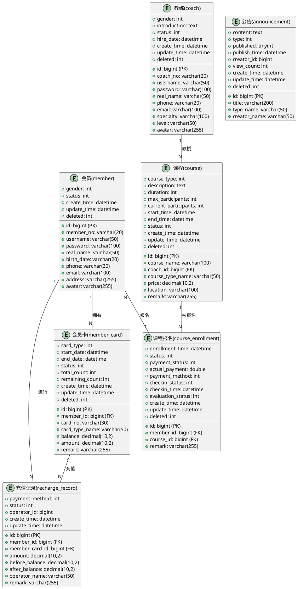

# 健身房管理系统数据库设计文档

## 1. 概述

### 1.1 文档目的
本文档详细描述健身房管理系统的数据库设计，包括数据库结构、表设计、字段定义、索引设计、关系模型等，为数据库开发、系统集成和维护提供依据。

### 1.2 术语定义
| 术语 | 解释 |
|------|------|
| 主键 | 用于唯一标识表中记录的字段 |
| 外键 | 用于关联其他表的关键字段 |
| 索引 | 提高数据查询效率的一种数据结构 |
| 逻辑删除 | 不物理删除记录，而是通过标记字段表示删除状态 |
| 字段填充 | 通过框架自动为特定字段设置值（如创建时间、更新时间） |
| 乐观锁 | 一种并发控制机制，通过版本号或时间戳防止数据覆盖 |

## 2. 数据库整体设计

### 2.1 数据库选型
- **数据库类型**: MySQL 8.0+
- **字符集**: utf8mb4
- **排序规则**: utf8mb4_unicode_ci
- **连接池**: HikariCP

### 2.2 数据库命名规范
- **数据库名**: 小写字母，使用下划线分隔（例如：gym_system）
- **表名**: 小写字母，使用下划线分隔（例如：member_card）
- **字段名**: 小写字母，使用下划线分隔（例如：member_no）
- **索引名**: 前缀+表名+字段名（例如：idx_member_id）
- **主键名**: 统一使用"id"

### 2.3 数据库安全策略
- 采用参数化查询防止SQL注入
- 敏感信息（如密码）进行加密存储
- 定期备份数据库
- 使用数据库用户权限最小化原则

## 3. 数据库表结构设计

### 3.1 实体关系图



### 3.2 详细表结构

#### 3.2.1 会员表(member)

| 字段名 | 数据类型 | 长度 | 约束 | 描述 |
| :--- | :--- | :--- | :--- | :--- |
| `id` | `bigint` | 20 | `PRIMARY KEY AUTO_INCREMENT` | 会员ID |
| `member_no` | `varchar` | 20 | `NOT NULL UNIQUE` | 会员编号 |
| `username` | `varchar` | 50 | `NOT NULL UNIQUE` | 用户名 |
| `password` | `varchar` | 100 | `NOT NULL` | 密码（加密存储） |
| `real_name` | `varchar` | 50 | `NOT NULL` | 真实姓名 |
| `gender` | `int` | 11 | `NOT NULL` | 性别(1-男，2-女) |
| `birth_date` | `varchar` | 20 | `NULL` | 出生日期 |
| `phone` | `varchar` | 20 | `NOT NULL UNIQUE` | 手机号码 |
| `email` | `varchar` | 100 | `NULL` | 邮箱地址 |
| `address` | `varchar` | 255 | `NULL` | 地址 |
| `avatar` | `varchar` | 255 | `NULL` | 头像URL |
| `status` | `int` | 11 | `NOT NULL DEFAULT 1` | 状态(0-禁用，1-正常，2-冻结) |
| `create_time` | `datetime` | - | `NOT NULL` | 创建时间 |
| `update_time` | `datetime` | - | `NOT NULL` | 更新时间 |
| `deleted` | `int` | 11 | `NOT NULL DEFAULT 0` | 逻辑删除标识(0-未删除，1-已删除) |

**表注释**: 存储会员基本信息，是系统的核心用户表
**索引设计**: 
- 主键索引: `PRIMARY KEY (id)`
- 唯一索引: `UNIQUE KEY uk_member_no (member_no)`
- 唯一索引: `UNIQUE KEY uk_username (username)`
- 唯一索引: `UNIQUE KEY uk_phone (phone)`

**建表SQL**:
```sql
CREATE TABLE `member` (
  `id` bigint(20) NOT NULL AUTO_INCREMENT COMMENT '会员ID',
  `member_no` varchar(20) NOT NULL COMMENT '会员编号',
  `username` varchar(50) NOT NULL COMMENT '用户名',
  `password` varchar(100) NOT NULL COMMENT '密码',
  `real_name` varchar(50) NOT NULL COMMENT '真实姓名',
  `gender` int(11) NOT NULL COMMENT '性别(1-男，2-女)',
  `birth_date` varchar(20) DEFAULT NULL COMMENT '出生日期',
  `phone` varchar(20) NOT NULL COMMENT '手机号码',
  `email` varchar(100) DEFAULT NULL COMMENT '邮箱地址',
  `address` varchar(255) DEFAULT NULL COMMENT '地址',
  `avatar` varchar(255) DEFAULT NULL COMMENT '头像URL',
  `status` int(11) NOT NULL DEFAULT '1' COMMENT '状态(0-禁用，1-正常，2-冻结)',
  `create_time` datetime NOT NULL COMMENT '创建时间',
  `update_time` datetime NOT NULL COMMENT '更新时间',
  `deleted` int(11) NOT NULL DEFAULT '0' COMMENT '逻辑删除标识(0-未删除，1-已删除)',
  PRIMARY KEY (`id`),
  UNIQUE KEY `uk_member_no` (`member_no`),
  UNIQUE KEY `uk_username` (`username`),
  UNIQUE KEY `uk_phone` (`phone`)
) ENGINE=InnoDB DEFAULT CHARSET=utf8mb4 COMMENT='会员表';
```

#### 3.2.2 会员卡表(member_card)

| 字段名 | 数据类型 | 长度 | 约束 | 描述 |
| :--- | :--- | :--- | :--- | :--- |
| `id` | `bigint` | 20 | `PRIMARY KEY AUTO_INCREMENT` | 会员卡ID |
| `member_id` | `bigint` | 20 | `NOT NULL FOREIGN KEY` | 会员ID，关联member表 |
| `card_no` | `varchar` | 30 | `NOT NULL UNIQUE` | 卡号 |
| `card_type` | `int` | 11 | `NOT NULL` | 卡类型(1-月卡，2-季卡，3-年卡，4-次卡，5-储值卡) |
| `card_type_name` | `varchar` | 50 | `NOT NULL` | 卡类型名称 |
| `start_date` | `datetime` | - | `NOT NULL` | 开通日期 |
| `end_date` | `datetime` | - | `NOT NULL` | 到期日期 |
| `status` | `int` | 11 | `NOT NULL DEFAULT 1` | 状态(0-未激活，1-正常，2-过期，3-冻结) |
| `balance` | `decimal` | 10,2 | `DEFAULT 0.00` | 余额(储值卡) |
| `total_count` | `int` | 11 | `DEFAULT 0` | 总次数(次卡) |
| `remaining_count` | `int` | 11 | `DEFAULT 0` | 剩余次数(次卡) |
| `amount` | `decimal` | 10,2 | `NULL` | 办卡金额 |
| `remark` | `varchar` | 255 | `NULL` | 备注 |
| `create_time` | `datetime` | - | `NOT NULL` | 创建时间 |
| `update_time` | `datetime` | - | `NOT NULL` | 更新时间 |
| `deleted` | `int` | 11 | `NOT NULL DEFAULT 0` | 逻辑删除标识(0-未删除，1-已删除) |

**表注释**: 存储会员卡信息，记录会员的消费卡状态和余额
**索引设计**: 
- 主键索引: `PRIMARY KEY (id)`
- 唯一索引: `UNIQUE KEY uk_card_no (card_no)`
- 普通索引: `KEY idx_member_id (member_id)`
- 普通索引: `KEY idx_status (status)`
- 普通索引: `KEY idx_end_date (end_date)`

**建表SQL**:
```sql
CREATE TABLE `member_card` (
  `id` bigint(20) NOT NULL AUTO_INCREMENT COMMENT '会员卡ID',
  `member_id` bigint(20) NOT NULL COMMENT '会员ID',
  `card_no` varchar(30) NOT NULL COMMENT '卡号',
  `card_type` int(11) NOT NULL COMMENT '卡类型(1-月卡，2-季卡，3-年卡，4-次卡，5-储值卡)',
  `card_type_name` varchar(50) NOT NULL COMMENT '卡类型名称',
  `start_date` datetime NOT NULL COMMENT '开通日期',
  `end_date` datetime NOT NULL COMMENT '到期日期',
  `status` int(11) NOT NULL DEFAULT '1' COMMENT '状态(0-未激活，1-正常，2-过期，3-冻结)',
  `balance` decimal(10,2) DEFAULT '0.00' COMMENT '余额(储值卡)',
  `total_count` int(11) DEFAULT '0' COMMENT '总次数(次卡)',
  `remaining_count` int(11) DEFAULT '0' COMMENT '剩余次数(次卡)',
  `amount` decimal(10,2) DEFAULT NULL COMMENT '办卡金额',
  `remark` varchar(255) DEFAULT NULL COMMENT '备注',
  `create_time` datetime NOT NULL COMMENT '创建时间',
  `update_time` datetime NOT NULL COMMENT '更新时间',
  `deleted` int(11) NOT NULL DEFAULT '0' COMMENT '逻辑删除标识(0-未删除，1-已删除)',
  PRIMARY KEY (`id`),
  UNIQUE KEY `uk_card_no` (`card_no`),
  KEY `idx_member_id` (`member_id`),
  KEY `idx_status` (`status`),
  KEY `idx_end_date` (`end_date`),
  CONSTRAINT `fk_member_card_member` FOREIGN KEY (`member_id`) REFERENCES `member` (`id`)
) ENGINE=InnoDB DEFAULT CHARSET=utf8mb4 COMMENT='会员卡表';
```

#### 3.2.3 教练表(coach)

| 字段名 | 数据类型 | 长度 | 约束 | 描述 |
| :--- | :--- | :--- | :--- | :--- |
| `id` | `bigint` | 20 | `PRIMARY KEY AUTO_INCREMENT` | 教练ID |
| `coach_no` | `varchar` | 20 | `NOT NULL UNIQUE` | 教练编号 |
| `username` | `varchar` | 50 | `NOT NULL UNIQUE` | 用户名 |
| `password` | `varchar` | 100 | `NOT NULL` | 密码（加密存储） |
| `real_name` | `varchar` | 50 | `NOT NULL` | 真实姓名 |
| `gender` | `int` | 11 | `NOT NULL` | 性别(1-男，2-女) |
| `phone` | `varchar` | 20 | `NOT NULL UNIQUE` | 手机号码 |
| `email` | `varchar` | 100 | `NULL` | 邮箱地址 |
| `specialty` | `varchar` | 100 | `NULL` | 专业领域 |
| `level` | `varchar` | 50 | `NULL` | 教练级别 |
| `introduction` | `text` | - | `NULL` | 简介 |
| `avatar` | `varchar` | 255 | `NULL` | 头像URL |
| `status` | `int` | 11 | `NOT NULL DEFAULT 1` | 状态(0-禁用，1-正常，2-休假，3-离职) |
| `hire_date` | `datetime` | - | `NULL` | 入职时间 |
| `create_time` | `datetime` | - | `NOT NULL` | 创建时间 |
| `update_time` | `datetime` | - | `NOT NULL` | 更新时间 |
| `deleted` | `int` | 11 | `NOT NULL DEFAULT 0` | 逻辑删除标识(0-未删除，1-已删除) |

**表注释**: 存储教练信息，包含教练的基本资料和专业信息
**索引设计**: 
- 主键索引: `PRIMARY KEY (id)`
- 唯一索引: `UNIQUE KEY uk_coach_no (coach_no)`
- 唯一索引: `UNIQUE KEY uk_username (username)`
- 唯一索引: `UNIQUE KEY uk_phone (phone)`
- 普通索引: `KEY idx_status (status)`

**建表SQL**:
```sql
CREATE TABLE `coach` (
  `id` bigint(20) NOT NULL AUTO_INCREMENT COMMENT '教练ID',
  `coach_no` varchar(20) NOT NULL COMMENT '教练编号',
  `username` varchar(50) NOT NULL COMMENT '用户名',
  `password` varchar(100) NOT NULL COMMENT '密码',
  `real_name` varchar(50) NOT NULL COMMENT '真实姓名',
  `gender` int(11) NOT NULL COMMENT '性别(1-男，2-女)',
  `phone` varchar(20) NOT NULL COMMENT '手机号码',
  `email` varchar(100) DEFAULT NULL COMMENT '邮箱地址',
  `specialty` varchar(100) DEFAULT NULL COMMENT '专业领域',
  `level` varchar(50) DEFAULT NULL COMMENT '教练级别',
  `introduction` text COMMENT '简介',
  `avatar` varchar(255) DEFAULT NULL COMMENT '头像URL',
  `status` int(11) NOT NULL DEFAULT '1' COMMENT '状态(0-禁用，1-正常，2-休假，3-离职)',
  `hire_date` datetime DEFAULT NULL COMMENT '入职时间',
  `create_time` datetime NOT NULL COMMENT '创建时间',
  `update_time` datetime NOT NULL COMMENT '更新时间',
  `deleted` int(11) NOT NULL DEFAULT '0' COMMENT '逻辑删除标识(0-未删除，1-已删除)',
  PRIMARY KEY (`id`),
  UNIQUE KEY `uk_coach_no` (`coach_no`),
  UNIQUE KEY `uk_username` (`username`),
  UNIQUE KEY `uk_phone` (`phone`),
  KEY `idx_status` (`status`)
) ENGINE=InnoDB DEFAULT CHARSET=utf8mb4 COMMENT='教练表';
```

#### 3.2.4 课程表(course)

| 字段名 | 数据类型 | 长度 | 约束 | 描述 |
| :--- | :--- | :--- | :--- | :--- |
| `id` | `bigint` | 20 | `PRIMARY KEY AUTO_INCREMENT` | 课程ID |
| `course_name` | `varchar` | 100 | `NOT NULL` | 课程名称 |
| `coach_id` | `bigint` | 20 | `NOT NULL FOREIGN KEY` | 教练ID，关联coach表 |
| `course_type` | `int` | 11 | `NOT NULL` | 课程类型(1-团体课，2-私教课，3-特色课) |
| `course_type_name` | `varchar` | 50 | `NOT NULL` | 课程类型名称 |
| `description` | `text` | - | `NULL` | 课程描述 |
| `duration` | `int` | 11 | `NOT NULL` | 课程时长(分钟) |
| `price` | `decimal` | 10,2 | `NOT NULL` | 课程价格 |
| `location` | `varchar` | 100 | `NOT NULL` | 上课地点 |
| `max_participants` | `int` | 11 | `NOT NULL` | 最大人数 |
| `current_participants` | `int` | 11 | `DEFAULT 0` | 当前报名人数 |
| `start_time` | `datetime` | - | `NOT NULL` | 课程开始时间 |
| `end_time` | `datetime` | - | `NOT NULL` | 课程结束时间 |
| `status` | `int` | 11 | `NOT NULL DEFAULT 0` | 状态(0-未开始，1-进行中，2-已结束，3-已取消) |
| `remark` | `varchar` | 255 | `NULL` | 备注 |
| `create_time` | `datetime` | - | `NOT NULL` | 创建时间 |
| `update_time` | `datetime` | - | `NOT NULL` | 更新时间 |
| `deleted` | `int` | 11 | `NOT NULL DEFAULT 0` | 逻辑删除标识(0-未删除，1-已删除) |

**表注释**: 存储课程信息，包含课程的基本信息、时间安排和状态
**索引设计**: 
- 主键索引: `PRIMARY KEY (id)`
- 普通索引: `KEY idx_coach_id (coach_id)`
- 普通索引: `KEY idx_start_time (start_time)`
- 普通索引: `KEY idx_status (status)`
- 普通索引: `KEY idx_course_type (course_type)`

**建表SQL**:
```sql
CREATE TABLE `course` (
  `id` bigint(20) NOT NULL AUTO_INCREMENT COMMENT '课程ID',
  `course_name` varchar(100) NOT NULL COMMENT '课程名称',
  `coach_id` bigint(20) NOT NULL COMMENT '教练ID',
  `course_type` int(11) NOT NULL COMMENT '课程类型(1-团体课，2-私教课，3-特色课)',
  `course_type_name` varchar(50) NOT NULL COMMENT '课程类型名称',
  `description` text COMMENT '课程描述',
  `duration` int(11) NOT NULL COMMENT '课程时长(分钟)',
  `price` decimal(10,2) NOT NULL COMMENT '课程价格',
  `location` varchar(100) NOT NULL COMMENT '上课地点',
  `max_participants` int(11) NOT NULL COMMENT '最大人数',
  `current_participants` int(11) DEFAULT '0' COMMENT '当前报名人数',
  `start_time` datetime NOT NULL COMMENT '课程开始时间',
  `end_time` datetime NOT NULL COMMENT '课程结束时间',
  `status` int(11) NOT NULL DEFAULT '0' COMMENT '状态(0-未开始，1-进行中，2-已结束，3-已取消)',
  `remark` varchar(255) DEFAULT NULL COMMENT '备注',
  `create_time` datetime NOT NULL COMMENT '创建时间',
  `update_time` datetime NOT NULL COMMENT '更新时间',
  `deleted` int(11) NOT NULL DEFAULT '0' COMMENT '逻辑删除标识(0-未删除，1-已删除)',
  PRIMARY KEY (`id`),
  KEY `idx_coach_id` (`coach_id`),
  KEY `idx_start_time` (`start_time`),
  KEY `idx_status` (`status`),
  KEY `idx_course_type` (`course_type`),
  CONSTRAINT `fk_course_coach` FOREIGN KEY (`coach_id`) REFERENCES `coach` (`id`)
) ENGINE=InnoDB DEFAULT CHARSET=utf8mb4 COMMENT='课程表';
```

#### 3.2.5 课程报名表(course_enrollment)

| 字段名 | 数据类型 | 长度 | 约束 | 描述 |
| :--- | :--- | :--- | :--- | :--- |
| `id` | `bigint` | 20 | `PRIMARY KEY AUTO_INCREMENT` | 报名ID |
| `member_id` | `bigint` | 20 | `NOT NULL FOREIGN KEY` | 会员ID，关联member表 |
| `course_id` | `bigint` | 20 | `NOT NULL FOREIGN KEY` | 课程ID，关联course表 |
| `enrollment_time` | `datetime` | - | `NOT NULL` | 报名时间 |
| `status` | `int` | 11 | `NOT NULL DEFAULT 0` | 报名状态(0-待确认，1-已确认，2-已完成，3-已取消，4-已过期) |
| `payment_status` | `int` | 11 | `NOT NULL DEFAULT 0` | 支付状态(0-未支付，1-已支付) |
| `actual_payment` | `double` | - | `NULL` | 实付金额 |
| `payment_method` | `int` | 11 | `NULL` | 支付方式(1-余额支付，2-微信支付，3-支付宝) |
| `checkin_status` | `int` | 11 | `DEFAULT 0` | 签到状态(0-未签到，1-已签到) |
| `checkin_time` | `datetime` | - | `NULL` | 签到时间 |
| `evaluation_status` | `int` | 11 | `DEFAULT 0` | 评价状态(0-未评价，1-已评价) |
| `remark` | `varchar` | 255 | `NULL` | 备注 |
| `create_time` | `datetime` | - | `NOT NULL` | 创建时间 |
| `update_time` | `datetime` | - | `NOT NULL` | 更新时间 |
| `deleted` | `int` | 11 | `NOT NULL DEFAULT 0` | 逻辑删除标识(0-未删除，1-已删除) |

**表注释**: 存储会员报名课程的记录，管理课程的报名、支付和签到流程
**索引设计**: 
- 主键索引: `PRIMARY KEY (id)`
- 普通索引: `KEY idx_member_id (member_id)`
- 普通索引: `KEY idx_course_id (course_id)`
- 普通索引: `KEY idx_status (status)`
- 普通索引: `KEY idx_payment_status (payment_status)`
- 组合索引: `KEY idx_member_course (member_id, course_id)`

**建表SQL**:
```sql
CREATE TABLE `course_enrollment` (
  `id` bigint(20) NOT NULL AUTO_INCREMENT COMMENT '报名ID',
  `member_id` bigint(20) NOT NULL COMMENT '会员ID',
  `course_id` bigint(20) NOT NULL COMMENT '课程ID',
  `enrollment_time` datetime NOT NULL COMMENT '报名时间',
  `status` int(11) NOT NULL DEFAULT '0' COMMENT '报名状态(0-待确认，1-已确认，2-已完成，3-已取消，4-已过期)',
  `payment_status` int(11) NOT NULL DEFAULT '0' COMMENT '支付状态(0-未支付，1-已支付)',
  `actual_payment` double DEFAULT NULL COMMENT '实付金额',
  `payment_method` int(11) DEFAULT NULL COMMENT '支付方式(1-余额支付，2-微信支付，3-支付宝)',
  `checkin_status` int(11) DEFAULT '0' COMMENT '签到状态(0-未签到，1-已签到)',
  `checkin_time` datetime DEFAULT NULL COMMENT '签到时间',
  `evaluation_status` int(11) DEFAULT '0' COMMENT '评价状态(0-未评价，1-已评价)',
  `remark` varchar(255) DEFAULT NULL COMMENT '备注',
  `create_time` datetime NOT NULL COMMENT '创建时间',
  `update_time` datetime NOT NULL COMMENT '更新时间',
  `deleted` int(11) NOT NULL DEFAULT '0' COMMENT '逻辑删除标识(0-未删除，1-已删除)',
  PRIMARY KEY (`id`),
  KEY `idx_member_id` (`member_id`),
  KEY `idx_course_id` (`course_id`),
  KEY `idx_status` (`status`),
  KEY `idx_payment_status` (`payment_status`),
  KEY `idx_member_course` (`member_id`, `course_id`),
  CONSTRAINT `fk_enrollment_member` FOREIGN KEY (`member_id`) REFERENCES `member` (`id`),
  CONSTRAINT `fk_enrollment_course` FOREIGN KEY (`course_id`) REFERENCES `course` (`id`)
) ENGINE=InnoDB DEFAULT CHARSET=utf8mb4 COMMENT='课程报名表';
```

#### 3.2.6 公告表(announcement)

| 字段名 | 数据类型 | 长度 | 约束 | 描述 |
| :--- | :--- | :--- | :--- | :--- |
| `id` | `bigint` | 20 | `PRIMARY KEY AUTO_INCREMENT` | 公告ID |
| `title` | `varchar` | 200 | `NOT NULL` | 标题 |
| `content` | `text` | - | `NOT NULL` | 内容 |
| `type` | `int` | 11 | `NOT NULL DEFAULT 1` | 类型(1-系统公告，2-活动通知) |
| `type_name` | `varchar` | 50 | `NOT NULL DEFAULT '系统公告'` | 类型名称 |
| `published` | `tinyint` | 1 | `NOT NULL DEFAULT 0` | 是否发布(0-未发布，1-已发布) |
| `publish_time` | `datetime` | - | `NULL` | 发布时间 |
| `creator_id` | `bigint` | 20 | `NULL` | 创建人ID |
| `creator_name` | `varchar` | 50 | `NULL` | 创建人姓名 |
| `view_count` | `int` | 11 | `DEFAULT 0` | 查看次数 |
| `create_time` | `datetime` | - | `NOT NULL` | 创建时间 |
| `update_time` | `datetime` | - | `NOT NULL` | 更新时间 |
| `deleted` | `int` | 11 | `NOT NULL DEFAULT 0` | 逻辑删除标识(0-未删除，1-已删除) |

**表注释**: 存储系统公告和活动通知信息
**索引设计**: 
- 主键索引: `PRIMARY KEY (id)`
- 普通索引: `KEY idx_published (published)`
- 普通索引: `KEY idx_publish_time (publish_time)`
- 普通索引: `KEY idx_type (type)`

**建表SQL**:
```sql
CREATE TABLE `announcement` (
  `id` bigint(20) NOT NULL AUTO_INCREMENT COMMENT '公告ID',
  `title` varchar(200) NOT NULL COMMENT '标题',
  `content` text NOT NULL COMMENT '内容',
  `type` int(11) NOT NULL DEFAULT '1' COMMENT '类型(1-系统公告，2-活动通知)',
  `type_name` varchar(50) NOT NULL DEFAULT '系统公告' COMMENT '类型名称',
  `published` tinyint(1) NOT NULL DEFAULT '0' COMMENT '是否发布(0-未发布，1-已发布)',
  `publish_time` datetime DEFAULT NULL COMMENT '发布时间',
  `creator_id` bigint(20) DEFAULT NULL COMMENT '创建人ID',
  `creator_name` varchar(50) DEFAULT NULL COMMENT '创建人姓名',
  `view_count` int(11) DEFAULT '0' COMMENT '查看次数',
  `create_time` datetime NOT NULL COMMENT '创建时间',
  `update_time` datetime NOT NULL COMMENT '更新时间',
  `deleted` int(11) NOT NULL DEFAULT '0' COMMENT '逻辑删除标识(0-未删除，1-已删除)',
  PRIMARY KEY (`id`),
  KEY `idx_published` (`published`),
  KEY `idx_publish_time` (`publish_time`),
  KEY `idx_type` (`type`)
) ENGINE=InnoDB DEFAULT CHARSET=utf8mb4 COMMENT='公告表';
```

#### 3.2.7 充值记录表(recharge_record)

| 字段名 | 数据类型 | 长度 | 约束 | 描述 |
| :--- | :--- | :--- | :--- | :--- |
| `id` | `bigint` | 20 | `PRIMARY KEY AUTO_INCREMENT` | 充值记录ID |
| `member_id` | `bigint` | 20 | `NOT NULL FOREIGN KEY` | 会员ID，关联member表 |
| `member_card_id` | `bigint` | 20 | `NOT NULL FOREIGN KEY` | 会员卡ID，关联member_card表 |
| `amount` | `decimal` | 10,2 | `NOT NULL` | 充值金额 |
| `before_balance` | `decimal` | 10,2 | `NOT NULL` | 充值前余额 |
| `after_balance` | `decimal` | 10,2 | `NOT NULL` | 充值后余额 |
| `payment_method` | `int` | 11 | `NOT NULL` | 支付方式(1-余额支付，2-微信支付，3-支付宝) |
| `status` | `int` | 11 | `NOT NULL DEFAULT 0` | 状态(0-处理中，1-成功，2-失败) |
| `operator_id` | `bigint` | 20 | `NULL` | 操作人ID |
| `operator_name` | `varchar` | 50 | `NULL` | 操作人姓名 |
| `remark` | `varchar` | 255 | `NULL` | 备注 |
| `create_time` | `datetime` | - | `NOT NULL` | 创建时间 |
| `update_time` | `datetime` | - | `NOT NULL` | 更新时间 |

**表注释**: 记录会员卡充值历史，用于财务对账和会员消费记录
**索引设计**: 
- 主键索引: `PRIMARY KEY (id)`
- 普通索引: `KEY idx_member_id (member_id)`
- 普通索引: `KEY idx_member_card_id (member_card_id)`
- 普通索引: `KEY idx_status (status)`
- 普通索引: `KEY idx_create_time (create_time)`

**建表SQL**:
```sql
CREATE TABLE `recharge_record` (
  `id` bigint(20) NOT NULL AUTO_INCREMENT COMMENT '充值记录ID',
  `member_id` bigint(20) NOT NULL COMMENT '会员ID',
  `member_card_id` bigint(20) NOT NULL COMMENT '会员卡ID',
  `amount` decimal(10,2) NOT NULL COMMENT '充值金额',
  `before_balance` decimal(10,2) NOT NULL COMMENT '充值前余额',
  `after_balance` decimal(10,2) NOT NULL COMMENT '充值后余额',
  `payment_method` int(11) NOT NULL COMMENT '支付方式(1-余额支付，2-微信支付，3-支付宝)',
  `status` int(11) NOT NULL DEFAULT '0' COMMENT '状态(0-处理中，1-成功，2-失败)',
  `operator_id` bigint(20) DEFAULT NULL COMMENT '操作人ID',
  `operator_name` varchar(50) DEFAULT NULL COMMENT '操作人姓名',
  `remark` varchar(255) DEFAULT NULL COMMENT '备注',
  `create_time` datetime NOT NULL COMMENT '创建时间',
  `update_time` datetime NOT NULL COMMENT '更新时间',
  PRIMARY KEY (`id`),
  KEY `idx_member_id` (`member_id`),
  KEY `idx_member_card_id` (`member_card_id`),
  KEY `idx_status` (`status`),
  KEY `idx_create_time` (`create_time`),
  CONSTRAINT `fk_recharge_member` FOREIGN KEY (`member_id`) REFERENCES `member` (`id`),
  CONSTRAINT `fk_recharge_member_card` FOREIGN KEY (`member_card_id`) REFERENCES `member_card` (`id`)
) ENGINE=InnoDB DEFAULT CHARSET=utf8mb4 COMMENT='充值记录表';
```

## 4. 索引设计

### 4.1 索引优化策略

1. **主键索引**
   - 每个表都必须有主键，推荐使用自增ID
   - 主键索引效率最高，应优先使用主键查询

2. **唯一索引**
   - 对唯一性约束的字段创建唯一索引
   - 加速唯一性检查，同时提供查询性能
   - 例如：会员编号、用户名、手机号、卡号等

3. **外键索引**
   - 对外键字段创建普通索引
   - 加速表关联查询，避免表扫描
   - 例如：member_id、coach_id、course_id等

4. **查询优化索引**
   - 为常用查询条件的字段创建索引
   - 遵循最左前缀原则，合理设计复合索引
   - 避免创建过多索引，防止写入性能下降

### 4.2 索引维护建议

1. **定期分析索引使用情况**
   - 使用`EXPLAIN`分析SQL执行计划
   - 发现未使用的索引并及时删除

2. **索引重建**
   - 定期重建使用率高的索引
   - 避免索引碎片影响查询性能

3. **监控索引统计信息**
   - 保持索引统计信息及时更新
   - 确保查询优化器能正确选择执行计划

## 5. 数据完整性与约束

### 5.1 实体完整性
- 通过主键约束确保表中记录的唯一性
- 主键字段不允许为空

### 5.2 参照完整性
- 通过外键约束维护表之间的关系
- 防止无效数据的插入和删除
- 支持级联操作（根据实际需求配置）

### 5.3 域完整性
- 通过数据类型和约束条件确保字段值的有效性
- 使用NOT NULL、DEFAULT、CHECK等约束
- 对于业务规则约束，在应用层实现验证

### 5.4 逻辑删除机制
- 采用逻辑删除而非物理删除
- 通过deleted字段标记记录状态
- 查询时默认过滤已删除记录

## 6. 数据备份与恢复策略

### 6.1 备份策略

| 备份类型 | 频率 | 方式 | 保留期限 |
|---------|-----|------|--------|
| 全量备份 | 每周一次 | mysqldump | 30天 |
| 增量备份 | 每日一次 | binlog | 7天 |
| 事务日志 | 实时 | binlog | 15天 |

### 6.2 恢复策略
- 定期测试备份恢复流程
- 制定详细的数据恢复计划
- 明确恢复时间目标(RTO)和恢复点目标(RPO)

### 6.3 备份建议
- 备份文件应存储在与数据库服务器不同的物理位置
- 考虑使用加密方式存储备份文件
- 备份操作应在系统负载较低时执行

## 7. 性能优化建议

### 7.1 查询优化

1. **避免全表扫描**
   - 为查询条件字段创建索引
   - 使用`LIMIT`限制返回结果数量

2. **优化关联查询**
   - 合理使用JOIN，避免过多表关联
   - 小表驱动大表，提高查询效率

3. **使用EXPLAIN分析**
   - 定期分析复杂查询的执行计划
   - 根据分析结果优化SQL语句

### 7.2 数据库连接池优化

| 参数 | 建议值 | 说明 |
|------|-------|------|
| minimum-idle | 5-10 | 最小空闲连接数 |
| maximum-pool-size | 20-50 | 最大连接数 |
| connection-timeout | 30000ms | 连接超时时间 |
| idle-timeout | 600000ms | 空闲超时时间 |
| max-lifetime | 1800000ms | 连接最大生命周期 |

### 7.3 其他优化建议

1. **分区表**
   - 对于大表可考虑使用分区表
   - 按时间或业务维度进行分区

2. **读写分离**
   - 当单库性能不足时，可考虑读写分离
   - 主库处理写操作，从库处理读操作

3. **缓存策略**
   - 合理使用Redis缓存热点数据
   - 减少数据库访问压力

## 8. 总结

本文档详细描述了健身房管理系统的数据库设计，包括表结构、字段定义、索引设计、关系模型和优化策略等。该设计充分考虑了系统的功能性需求和性能需求，为系统的稳定运行和后续扩展提供了坚实的基础。

在实施过程中，应严格按照本文档的设计进行数据库创建和维护，同时结合实际运行情况，定期对数据库进行优化和调整，确保系统的高效稳定运行。