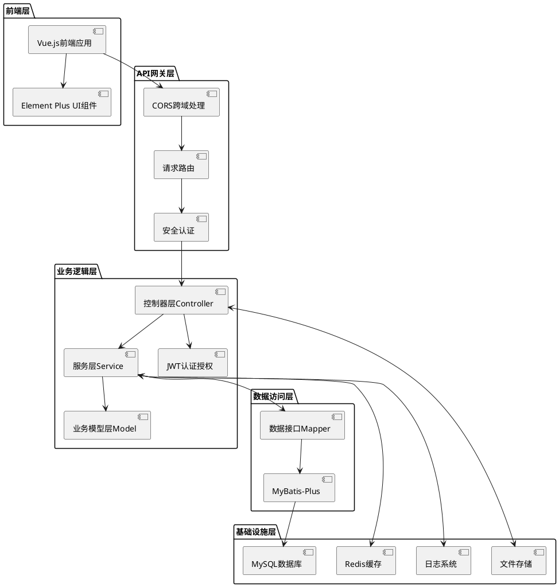
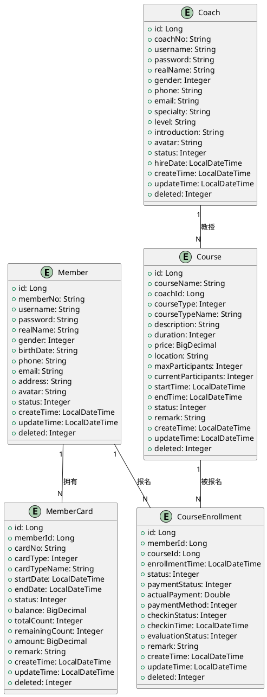
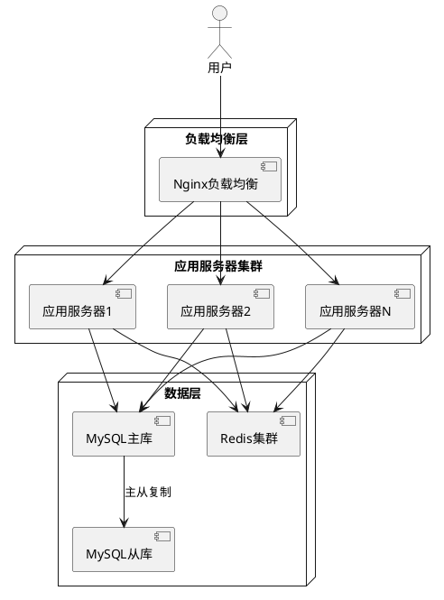

# 健身房管理系统概要设计文档

## 1. 系统概述

### 1.1 项目背景
本项目是一个基于Spring Boot的健身房管理系统，旨在为健身房提供完整的会员管理、教练管理和课程管理解决方案。系统采用前后端分离架构，使用Java作为后端开发语言，Vue.js作为前端框架，MySQL作为数据存储，Redis作为缓存，实现了一个功能完整、性能优良的现代健身房管理平台。

### 1.2 系统目标
- 实现会员信息、会员卡、课程报名等核心业务流程的数字化管理
- 为教练提供课程管理和学员管理功能
- 为管理员提供全面的系统管理和数据分析能力
- 确保系统的安全性、稳定性和可扩展性

## 2. 系统架构设计

### 2.1 整体架构

### 2.2 分层架构说明

1. **前端层**：基于Vue.js构建用户界面，使用Element Plus组件库实现丰富的UI交互。

2. **API网关层**：处理HTTP请求的入口，负责跨域处理、请求路由和初步的安全认证。

3. **业务逻辑层**：系统的核心，包含：
   - **控制器层**：处理HTTP请求，参数校验，调用服务层，返回响应
   - **服务层**：实现核心业务逻辑，事务管理
   - **业务模型层**：定义业务实体和领域模型
   - **认证授权**：基于JWT的用户认证和权限控制

4. **数据访问层**：负责与数据库交互，使用MyBatis-Plus简化数据访问操作。

5. **基础设施层**：提供系统运行所需的基础服务。

### 2.3 技术栈选择

| 分类 | 技术/框架 | 版本 | 用途 |
|------|----------|------|------|
| 后端框架 | Spring Boot | 2.7.13 | 应用基础框架 |
| 安全认证 | Spring Security | 内嵌 | 安全框架 |
| 持久层 | MyBatis-Plus | 3.5.3.1 | ORM框架 |
| 数据库 | MySQL | 8.0+ | 关系型数据库 |
| 缓存 | Redis | 6.0+ | 分布式缓存 |
| 认证 | JWT | 0.9.1 | 无状态认证 |
| API文档 | Swagger | 3.0.0 | API接口文档 |
| 工具库 | Lombok | 1.18.26 | 简化Java代码 |
| 前端框架 | Vue.js | 3.x | 前端MVVM框架 |
| UI组件库 | Element Plus | 2.x | Vue组件库 |

## 3. 模块划分与功能说明

### 3.1 系统模块架构

```plantuml
@startuml 模块架构图

package "健身房管理系统" {
  package "公共模块" {
    [通用工具类] as CommonUtils
    [统一响应] as Response
    [异常处理] as ExceptionHandler
    [日志管理] as LogManager
  }
  
  package "会员模块" {
    [会员信息管理] as MemberManage
    [会员卡管理] as CardManage
    [余额充值管理] as RechargeManage
    [课程报名管理] as EnrollManage
    [公告信息查看] as AnnouncementView
  }
  
  package "教练模块" {
    [个人中心管理] as CoachCenter
    [课程信息管理] as CoachCourseManage
    [报名学员管理] as CoachEnrollmentManage
  }
  
  package "管理员模块" {
    [会员注册管理] as AdminMemberManage
    [会员卡管理] as AdminCardManage
    [续卡管理] as RenewCardManage
    [到期提醒管理] as ExpiryRemind
    [报名课程管理] as AdminEnrollManage
    [公告管理] as AnnouncementManage
    [系统配置] as SystemConfig
  }
  
  package "认证授权模块" {
    [用户登录] as Login
    [权限控制] as Permission
    [Token管理] as TokenManage
  }
}

CommonUtils --> MemberManage
CommonUtils --> CardManage
CommonUtils --> RechargeManage
CommonUtils --> EnrollManage
CommonUtils --> CoachCenter
CommonUtils --> CoachCourseManage
CommonUtils --> CoachEnrollmentManage
CommonUtils --> AdminMemberManage
CommonUtils --> AdminCardManage
CommonUtils --> RenewCardManage
CommonUtils --> ExpiryRemind
CommonUtils --> AdminEnrollManage
CommonUtils --> AnnouncementManage
CommonUtils --> SystemConfig

Response --> MemberManage
Response --> CardManage
Response --> RechargeManage
Response --> EnrollManage
Response --> CoachCenter
Response --> CoachCourseManage
Response --> CoachEnrollmentManage
Response --> AdminMemberManage
Response --> AdminCardManage
Response --> RenewCardManage
Response --> ExpiryRemind
Response --> AdminEnrollManage
Response --> AnnouncementManage
Response --> SystemConfig

ExceptionHandler --> MemberManage
ExceptionHandler --> CardManage
ExceptionHandler --> RechargeManage
ExceptionHandler --> EnrollManage
ExceptionHandler --> CoachCenter
ExceptionHandler --> CoachCourseManage
ExceptionHandler --> CoachEnrollmentManage
ExceptionHandler --> AdminMemberManage
ExceptionHandler --> AdminCardManage
ExceptionHandler --> RenewCardManage
ExceptionHandler --> ExpiryRemind
ExceptionHandler --> AdminEnrollManage
ExceptionHandler --> AnnouncementManage
ExceptionHandler --> SystemConfig

Login --> MemberManage
Login --> CoachCenter
Login --> AdminMemberManage

Permission --> MemberManage
Permission --> CardManage
Permission --> RechargeManage
Permission --> EnrollManage
Permission --> CoachCenter
Permission --> CoachCourseManage
Permission --> CoachEnrollmentManage
Permission --> AdminMemberManage
Permission --> AdminCardManage
Permission --> RenewCardManage
Permission --> ExpiryRemind
Permission --> AdminEnrollManage
Permission --> AnnouncementManage
Permission --> SystemConfig

TokenManage --> Login
TokenManage --> Permission

@enduml
```

### 3.2 核心模块功能说明

#### 3.2.1 会员模块

1. **会员信息管理**
   - 会员注册、登录
   - 个人信息维护（修改姓名、手机号等）
   - 密码修改、找回

2. **会员卡管理**
   - 会员卡申请办理
   - 会员卡信息查询
   - 会员卡状态查询

3. **余额充值管理**
   - 账户余额查询
   - 余额充值操作
   - 充值记录查询

4. **课程报名管理**
   - 课程列表查询（按时间、教练、类型等筛选）
   - 课程详情查看
   - 报名课程操作
   - 报名记录查询
   - 取消报名

5. **公告信息查看**
   - 公告列表查询
   - 公告详情查看

#### 3.2.2 教练模块

1. **个人中心管理**
   - 个人信息维护
   - 密码修改
   - 工作状态设置

2. **课程信息管理**
   - 课程创建、编辑、删除
   - 课程列表查询与管理
   - 课程状态更新

3. **报名学员管理**
   - 查看报名自己课程的学员列表
   - 学员签到管理
   - 课程评价查看

#### 3.2.3 管理员模块

1. **会员注册管理**
   - 会员列表查询与筛选
   - 会员信息编辑
   - 会员状态管理（启用/禁用）
   - 会员删除（逻辑删除）

2. **会员卡管理**
   - 会员卡列表查询
   - 会员卡信息编辑
   - 会员卡状态管理
   - 会员卡类型管理

3. **续卡管理**
   - 会员续卡操作
   - 续卡记录查询

4. **到期提醒管理**
   - 即将到期会员卡查询
   - 到期提醒发送

5. **报名课程管理**
   - 所有课程报名记录查询
   - 报名状态管理
   - 报名统计

6. **公告管理**
   - 公告创建、编辑、删除
   - 公告发布状态管理
   - 公告列表查询

7. **系统配置**
   - 系统基础参数配置
   - 会员卡类型配置
   - 课程类型配置

## 4. 数据模型设计

### 4.1 核心实体关系图

### 4.2 数据模型详细说明

#### 4.2.1 会员表(Member)

| 字段名 | 数据类型 | 约束 | 描述 |
|--------|----------|------|------|
| id | BIGINT | 主键，自增 | 会员ID |
| memberNo | VARCHAR(20) | 唯一，非空 | 会员编号 |
| username | VARCHAR(50) | 唯一，非空 | 用户名 |
| password | VARCHAR(100) | 非空 | 加密后的密码 |
| realName | VARCHAR(50) | 非空 | 真实姓名 |
| gender | INT | 非空 | 性别(1-男，2-女) |
| birthDate | VARCHAR(20) | 可空 | 出生日期 |
| phone | VARCHAR(20) | 唯一，非空 | 手机号码 |
| email | VARCHAR(100) | 可空 | 邮箱地址 |
| address | VARCHAR(255) | 可空 | 地址 |
| avatar | VARCHAR(255) | 可空 | 头像URL |
| status | INT | 非空，默认1 | 状态(0-禁用，1-正常，2-冻结) |
| createTime | DATETIME | 非空 | 创建时间 |
| updateTime | DATETIME | 非空 | 更新时间 |
| deleted | INT | 非空，默认0 | 逻辑删除标识(0-未删除，1-已删除) |

#### 4.2.2 会员卡表(MemberCard)

| 字段名 | 数据类型 | 约束 | 描述 |
|--------|----------|------|------|
| id | BIGINT | 主键，自增 | 会员卡ID |
| memberId | BIGINT | 外键，非空 | 会员ID |
| cardNo | VARCHAR(30) | 唯一，非空 | 卡号 |
| cardType | INT | 非空 | 卡类型(1-月卡，2-季卡，3-年卡，4-次卡，5-储值卡) |
| cardTypeName | VARCHAR(50) | 非空 | 卡类型名称 |
| startDate | DATETIME | 非空 | 开通日期 |
| endDate | DATETIME | 非空 | 到期日期 |
| status | INT | 非空，默认1 | 状态(0-未激活，1-正常，2-过期，3-冻结) |
| balance | DECIMAL(10,2) | 默认0 | 余额(储值卡) |
| totalCount | INT | 默认0 | 总次数(次卡) |
| remainingCount | INT | 默认0 | 剩余次数(次卡) |
| amount | DECIMAL(10,2) | 可空 | 办卡金额 |
| remark | VARCHAR(255) | 可空 | 备注 |
| createTime | DATETIME | 非空 | 创建时间 |
| updateTime | DATETIME | 非空 | 更新时间 |
| deleted | INT | 非空，默认0 | 逻辑删除标识(0-未删除，1-已删除) |

#### 4.2.3 教练表(Coach)

| 字段名 | 数据类型 | 约束 | 描述 |
|--------|----------|------|------|
| id | BIGINT | 主键，自增 | 教练ID |
| coachNo | VARCHAR(20) | 唯一，非空 | 教练编号 |
| username | VARCHAR(50) | 唯一，非空 | 用户名 |
| password | VARCHAR(100) | 非空 | 加密后的密码 |
| realName | VARCHAR(50) | 非空 | 真实姓名 |
| gender | INT | 非空 | 性别(1-男，2-女) |
| phone | VARCHAR(20) | 唯一，非空 | 手机号码 |
| email | VARCHAR(100) | 可空 | 邮箱地址 |
| specialty | VARCHAR(100) | 可空 | 专业领域 |
| level | VARCHAR(50) | 可空 | 教练级别 |
| introduction | TEXT | 可空 | 简介 |
| avatar | VARCHAR(255) | 可空 | 头像URL |
| status | INT | 非空，默认1 | 状态(0-禁用，1-正常，2-休假，3-离职) |
| hireDate | DATETIME | 可空 | 入职时间 |
| createTime | DATETIME | 非空 | 创建时间 |
| updateTime | DATETIME | 非空 | 更新时间 |
| deleted | INT | 非空，默认0 | 逻辑删除标识(0-未删除，1-已删除) |

#### 4.2.4 课程表(Course)

| 字段名 | 数据类型 | 约束 | 描述 |
|--------|----------|------|------|
| id | BIGINT | 主键，自增 | 课程ID |
| courseName | VARCHAR(100) | 非空 | 课程名称 |
| coachId | BIGINT | 外键，非空 | 教练ID |
| courseType | INT | 非空 | 课程类型(1-团体课，2-私教课，3-特色课) |
| courseTypeName | VARCHAR(50) | 非空 | 课程类型名称 |
| description | TEXT | 可空 | 课程描述 |
| duration | INT | 非空 | 课程时长(分钟) |
| price | DECIMAL(10,2) | 非空 | 课程价格 |
| location | VARCHAR(100) | 非空 | 上课地点 |
| maxParticipants | INT | 非空 | 最大人数 |
| currentParticipants | INT | 默认0 | 当前报名人数 |
| startTime | DATETIME | 非空 | 课程开始时间 |
| endTime | DATETIME | 非空 | 课程结束时间 |
| status | INT | 非空，默认0 | 状态(0-未开始，1-进行中，2-已结束，3-已取消) |
| remark | VARCHAR(255) | 可空 | 备注 |
| createTime | DATETIME | 非空 | 创建时间 |
| updateTime | DATETIME | 非空 | 更新时间 |
| deleted | INT | 非空，默认0 | 逻辑删除标识(0-未删除，1-已删除) |

#### 4.2.5 课程报名表(CourseEnrollment)

| 字段名 | 数据类型 | 约束 | 描述 |
|--------|----------|------|------|
| id | BIGINT | 主键，自增 | 报名ID |
| memberId | BIGINT | 外键，非空 | 会员ID |
| courseId | BIGINT | 外键，非空 | 课程ID |
| enrollmentTime | DATETIME | 非空 | 报名时间 |
| status | INT | 非空，默认0 | 报名状态(0-待确认，1-已确认，2-已完成，3-已取消，4-已过期) |
| paymentStatus | INT | 非空，默认0 | 支付状态(0-未支付，1-已支付) |
| actualPayment | DOUBLE | 可空 | 实付金额 |
| paymentMethod | INT | 可空 | 支付方式(1-余额支付，2-微信支付，3-支付宝) |
| checkinStatus | INT | 默认0 | 签到状态(0-未签到，1-已签到) |
| checkinTime | DATETIME | 可空 | 签到时间 |
| evaluationStatus | INT | 默认0 | 评价状态(0-未评价，1-已评价) |
| remark | VARCHAR(255) | 可空 | 备注 |
| createTime | DATETIME | 非空 | 创建时间 |
| updateTime | DATETIME | 非空 | 更新时间 |
| deleted | INT | 非空，默认0 | 逻辑删除标识(0-未删除，1-已删除) |

## 5. API接口设计

### 5.1 会员模块API

| API路径 | 方法 | 模块/文件 | 功能描述 | 请求体 (JSON) | 成功响应 (200 OK) |
|---------|------|-----------|----------|---------------|-------------------|
| `/api/members/login` | POST | `member` | 会员登录 | `{"username": "...", "password": "..."}` | `{"code": 200, "message": "操作成功", "data": {"token": "...", "member": {...}}}` |
| `/api/members/register` | POST | `member` | 会员注册 | `{"username": "...", "password": "...", "realName": "...", "phone": "..."}` | `{"code": 200, "message": "注册成功", "data": {"id": 1}}` |
| `/api/members/info` | GET | `member` | 获取会员信息 | N/A | `{"code": 200, "message": "操作成功", "data": {...}}` |
| `/api/members/update` | PUT | `member` | 更新会员信息 | `{"realName": "...", "gender": 1, "phone": "..."}` | `{"code": 200, "message": "更新成功", "data": null}` |
| `/api/member-cards` | GET | `member-card` | 获取会员卡列表 | N/A | `{"code": 200, "message": "操作成功", "data": [...]}` |
| `/api/member-cards` | POST | `member-card` | 申请办理会员卡 | `{"cardType": 1, "amount": 300.00}` | `{"code": 200, "message": "办卡成功", "data": {"id": 1}}` |
| `/api/member-cards/{id}` | GET | `member-card` | 获取会员卡详情 | N/A | `{"code": 200, "message": "操作成功", "data": {...}}` |
| `/api/recharges` | POST | `recharge` | 余额充值 | `{"amount": 500.00, "paymentMethod": 1}` | `{"code": 200, "message": "充值成功", "data": {"balance": 800.00}}` |
| `/api/recharges/history` | GET | `recharge` | 获取充值记录 | N/A | `{"code": 200, "message": "操作成功", "data": [...]}` |
| `/api/courses` | GET | `course` | 获取课程列表 | N/A | `{"code": 200, "message": "操作成功", "data": [...]}` |
| `/api/courses/{id}` | GET | `course` | 获取课程详情 | N/A | `{"code": 200, "message": "操作成功", "data": {...}}` |
| `/api/enrollments` | POST | `enrollment` | 报名课程 | `{"courseId": 1}` | `{"code": 200, "message": "报名成功", "data": {"id": 1}}` |
| `/api/enrollments` | GET | `enrollment` | 获取报名记录 | N/A | `{"code": 200, "message": "操作成功", "data": [...]}` |
| `/api/enrollments/{id}` | DELETE | `enrollment` | 取消报名 | N/A | `{"code": 200, "message": "取消成功", "data": null}` |
| `/api/announcements` | GET | `announcement` | 获取公告列表 | N/A | `{"code": 200, "message": "操作成功", "data": [...]}` |
| `/api/announcements/{id}` | GET | `announcement` | 获取公告详情 | N/A | `{"code": 200, "message": "操作成功", "data": {...}}` |

### 5.2 教练模块API

| API路径 | 方法 | 模块/文件 | 功能描述 | 请求体 (JSON) | 成功响应 (200 OK) |
|---------|------|-----------|----------|---------------|-------------------|
| `/api/coaches/login` | POST | `coach` | 教练登录 | `{"username": "...", "password": "..."}` | `{"code": 200, "message": "操作成功", "data": {"token": "...", "coach": {...}}}` |
| `/api/coaches/info` | GET | `coach` | 获取教练信息 | N/A | `{"code": 200, "message": "操作成功", "data": {...}}` |
| `/api/coaches/update` | PUT | `coach` | 更新教练信息 | `{"realName": "...", "specialty": "...", "introduction": "..."}` | `{"code": 200, "message": "更新成功", "data": null}` |
| `/api/coach-courses` | POST | `coach-course` | 创建课程 | `{"courseName": "...", "courseType": 1, "startTime": "...", "endTime": "...", "price": 100.00}` | `{"code": 200, "message": "创建成功", "data": {"id": 1}}` |
| `/api/coach-courses` | GET | `coach-course` | 获取教练课程列表 | N/A | `{"code": 200, "message": "操作成功", "data": [...]}` |
| `/api/coach-courses/{id}` | PUT | `coach-course` | 更新课程信息 | `{"courseName": "...", "price": 120.00}` | `{"code": 200, "message": "更新成功", "data": null}` |
| `/api/coach-courses/{id}` | DELETE | `coach-course` | 删除课程 | N/A | `{"code": 200, "message": "删除成功", "data": null}` |
| `/api/coach-enrollments/{courseId}` | GET | `coach-enrollment` | 获取课程报名学员列表 | N/A | `{"code": 200, "message": "操作成功", "data": [...]}` |
| `/api/coach-enrollments/checkin/{id}` | PUT | `coach-enrollment` | 学员签到 | N/A | `{"code": 200, "message": "签到成功", "data": null}` |

### 5.3 管理员模块API

| API路径 | 方法 | 模块/文件 | 功能描述 | 请求体 (JSON) | 成功响应 (200 OK) |
|---------|------|-----------|----------|---------------|-------------------|
| `/api/admin/login` | POST | `admin` | 管理员登录 | `{"username": "...", "password": "..."}` | `{"code": 200, "message": "操作成功", "data": {"token": "...", "admin": {...}}}` |
| `/api/admin/members` | GET | `admin-member` | 获取会员列表 | N/A | `{"code": 200, "message": "操作成功", "data": {"total": 100, "list": [...]}}` |
| `/api/admin/members/{id}` | PUT | `admin-member` | 更新会员状态 | `{"status": 1}` | `{"code": 200, "message": "更新成功", "data": null}` |
| `/api/admin/member-cards` | GET | `admin-member-card` | 获取所有会员卡 | N/A | `{"code": 200, "message": "操作成功", "data": {"total": 50, "list": [...]}}` |
| `/api/admin/member-cards/{id}` | PUT | `admin-member-card` | 更新会员卡状态 | `{"status": 2}` | `{"code": 200, "message": "更新成功", "data": null}` |
| `/api/admin/member-cards/renew` | POST | `admin-member-card` | 会员续卡 | `{"cardId": 1, "newCardType": 2, "amount": 500.00}` | `{"code": 200, "message": "续卡成功", "data": {"id": 2}}` |
| `/api/admin/expiry-reminders` | GET | `admin-expiry` | 获取到期提醒列表 | N/A | `{"code": 200, "message": "操作成功", "data": [...]}` |
| `/api/admin/expiry-reminders/send` | POST | `admin-expiry` | 发送到期提醒 | `{"cardIds": [1, 2, 3]}` | `{"code": 200, "message": "发送成功", "data": {"successCount": 3}}` |
| `/api/admin/enrollments` | GET | `admin-enrollment` | 获取所有报名记录 | N/A | `{"code": 200, "message": "操作成功", "data": {"total": 200, "list": [...]}}` |
| `/api/admin/announcements` | POST | `admin-announcement` | 创建公告 | `{"title": "...", "content": "...", "type": 1}` | `{"code": 200, "message": "创建成功", "data": {"id": 1}}` |
| `/api/admin/announcements` | GET | `admin-announcement` | 获取公告列表 | N/A | `{"code": 200, "message": "操作成功", "data": {"total": 50, "list": [...]}}` |
| `/api/admin/announcements/{id}` | PUT | `admin-announcement` | 更新公告 | `{"title": "...", "content": "..."}` | `{"code": 200, "message": "更新成功", "data": null}` |
| `/api/admin/announcements/{id}/publish` | PUT | `admin-announcement` | 发布/取消发布公告 | `{"published": true}` | `{"code": 200, "message": "操作成功", "data": null}` |

## 6. 系统安全性设计

### 6.1 认证与授权

1. **JWT认证机制**
   - 用户登录后生成JWT令牌，包含用户信息和权限信息
   - 令牌设置合理的过期时间
   - 所有需要认证的API请求都需要在请求头中携带有效令牌

2. **基于角色的访问控制(RBAC)**
   - 定义三种核心角色：会员(MEMBER)、教练(COACH)、管理员(ADMIN)
   - 为每个角色分配不同的权限
   - 使用Spring Security实现细粒度的权限控制

3. **密码安全**
   - 用户密码使用BCrypt等安全算法加密存储
   - 设置密码强度要求
   - 支持密码找回功能

### 6.2 数据安全

1. **输入验证**
   - 对所有用户输入进行严格的验证和过滤
   - 防止SQL注入、XSS攻击等
   - 使用参数绑定避免SQL注入风险

2. **敏感数据保护**
   - 敏感数据(如身份证号、银行卡号等)加密存储
   - API响应中避免返回敏感信息
   - 日志记录时脱敏处理

3. **数据备份与恢复**
   - 定期进行数据库备份
   - 建立数据恢复机制

### 6.3 接口安全

1. **跨域资源共享(CORS)**
   - 配置适当的CORS策略，只允许授权的域名访问API

2. **API限流**
   - 对API请求进行限流，防止恶意请求和DDoS攻击

3. **日志审计**
   - 记录关键操作日志，便于安全审计和问题追踪
   - 记录用户登录、权限变更等敏感操作

## 7. 部署方案

### 7.1 硬件要求

| 环境 | CPU | 内存 | 存储 | 网络 |
|------|-----|------|------|------|
| 开发环境 | 4核 | 8GB | 100GB | 100Mbps |
| 测试环境 | 4核 | 16GB | 200GB | 1Gbps |
| 生产环境 | 8核 | 32GB | 500GB | 1Gbps+ |

### 7.2 软件环境

| 软件 | 版本 | 用途 |
|------|------|------|
| JDK | 1.8+ | Java运行环境 |
| MySQL | 8.0+ | 关系型数据库 |
| Redis | 6.0+ | 缓存数据库 |
| Nginx | 1.20+ | Web服务器/反向代理 |
| Docker | 20.10+ | 容器化部署 |
| Git | 2.30+ | 版本控制 |

### 7.3 部署架构

## 8. 系统扩展性设计

### 8.1 模块化设计
- 采用高内聚、低耦合的模块化设计
- 通过接口分离不同模块，便于独立开发和测试
- 使用依赖注入实现模块间的松耦合

### 8.2 微服务架构预留
- 系统核心功能已按领域划分，为后续微服务拆分做准备
- 数据模型设计考虑了服务边界
- API设计支持服务独立部署和扩展

### 8.3 第三方系统集成
- 预留支付接口，支持对接第三方支付平台
- 提供短信通知接口，支持对接短信服务提供商
- 支持人脸识别设备集成，用于会员签到

## 9. 总结与建议

### 9.1 设计总结
- 本系统采用Spring Boot + Vue.js + MySQL的技术栈，实现了一个功能完整的健身房管理系统
- 系统架构清晰，模块划分合理，具有良好的可扩展性和可维护性
- 数据模型设计考虑了业务需求和性能优化
- 安全性设计全面，包括认证授权、数据安全和接口安全

### 9.2 实施建议
- 采用迭代开发方式，先实现核心功能，再逐步添加高级功能
- 加强单元测试和集成测试，确保系统质量
- 重视用户体验，进行充分的UI/UX设计和用户测试
- 建立完善的监控和日志系统，便于问题排查和性能优化

### 9.3 后续优化方向
- 引入消息队列，处理异步任务，提高系统吞吐量
- 实现数据分片和读写分离，应对大数据量场景
- 开发移动端应用，提升用户体验
- 引入数据可视化和报表分析功能，为运营决策提供支持