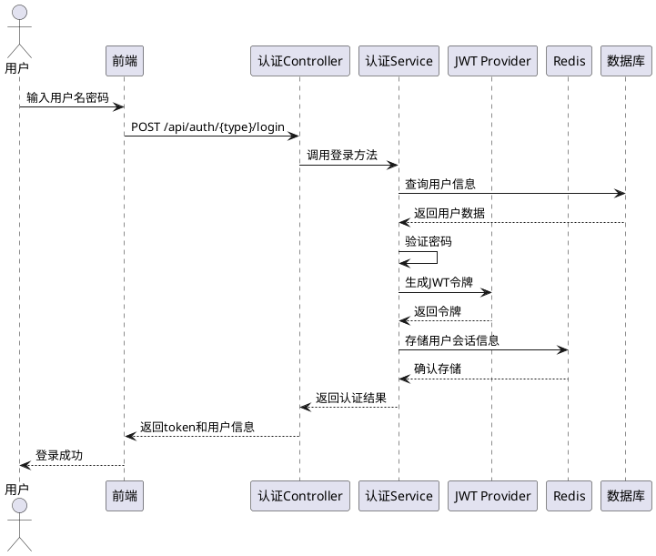

# 健身房管理系统详细设计文档

## 1. 概述

### 1.1 文档目的
本文档基于之前的概要设计文档，提供健身房管理系统的详细设计，包括系统架构的具体实现、文件目录结构、关键类和方法设计、数据库详细设计以及接口实现细节等，为开发团队提供具体的技术实现指导。

### 1.2 术语定义
| 术语 | 解释 |
|------|------|
| JWT | JSON Web Token，一种无状态的认证方式 |
| RBAC | Role-Based Access Control，基于角色的访问控制 |
| MyBatis-Plus | 基于MyBatis的增强工具，简化开发 |
| POJO | Plain Ordinary Java Object，普通Java对象 |
| DTO | Data Transfer Object，数据传输对象 |
| VO | View Object，视图对象 |
| AOP | Aspect-Oriented Programming，面向切面编程 |

## 2. 系统架构详细设计

### 2.1 技术栈详细说明

| 技术/框架 | 版本 | 用途 | 配置说明 |
|-----------|------|------|----------|
| Spring Boot | 2.7.13 | 应用框架 | 配置文件：application.yml |
| Spring Security | 内嵌 | 安全框架 | 配置类：SecurityConfig.java |
| MyBatis-Plus | 3.5.3.1 | ORM框架 | 配置类：MyBatisPlusConfig.java |
| MySQL | 8.0+ | 数据库 | 连接池：HikariCP |
| Redis | 6.0+ | 缓存 | 使用Lettuce客户端 |
| JWT | 0.9.1 | 认证 | 自定义JwtTokenProvider |
| Swagger3 | 3.0.0 | API文档 | 配置类：SwaggerConfig.java |
| Lombok | 1.18.26 | 代码简化 | IDE插件安装 |
| Hutool | 5.8.16 | 工具库 | 通用工具类 |
| MapStruct | 1.5.3.Final | 对象映射 | 简化DTO/Entity转换 |
| EasyExcel | 3.1.0 | Excel操作 | 数据导入导出 |

### 2.2 关键配置类设计

#### 2.2.1 Spring Security配置
```java
@Configuration
@EnableWebSecurity
@EnableGlobalMethodSecurity(prePostEnabled = true)
public class SecurityConfig extends WebSecurityConfigurerAdapter {
    
    @Autowired
    private JwtAuthenticationFilter jwtAuthenticationFilter;
    
    @Autowired
    private JwtAuthenticationEntryPoint jwtAuthenticationEntryPoint;
    
    @Autowired
    private JwtAccessDeniedHandler jwtAccessDeniedHandler;
    
    @Override
    protected void configure(HttpSecurity http) throws Exception {
        http
            .cors().and().csrf().disable()
            .sessionManagement().sessionCreationPolicy(SessionCreationPolicy.STATELESS)
            .and()
            .exceptionHandling()
            .authenticationEntryPoint(jwtAuthenticationEntryPoint)
            .accessDeniedHandler(jwtAccessDeniedHandler)
            .and()
            .authorizeRequests()
            .antMatchers("/api/auth/**", "/swagger-ui/**", "/v3/api-docs/**").permitAll()
            .anyRequest().authenticated();
        
        http.addFilterBefore(jwtAuthenticationFilter, UsernamePasswordAuthenticationFilter.class);
    }
    
    @Bean
    public PasswordEncoder passwordEncoder() {
        return new BCryptPasswordEncoder();
    }
}
```

#### 2.2.2 MyBatis-Plus配置
```java
@Configuration
@MapperScan("com.gym.mapper")
public class MyBatisPlusConfig {
    
    @Bean
    public MybatisPlusInterceptor mybatisPlusInterceptor() {
        MybatisPlusInterceptor interceptor = new MybatisPlusInterceptor();
        // 添加分页插件
        interceptor.addInnerInterceptor(new PaginationInnerInterceptor(DbType.MYSQL));
        // 添加乐观锁插件
        interceptor.addInnerInterceptor(new OptimisticLockerInnerInterceptor());
        return interceptor;
    }
    
    @Bean
    public MetaObjectHandler metaObjectHandler() {
        return new MyMetaObjectHandler();
    }
    
    // 自定义填充处理器
    static class MyMetaObjectHandler implements MetaObjectHandler {
        @Override
        public void insertFill(MetaObject metaObject) {
            this.strictInsertFill(metaObject, "createTime", LocalDateTime.class, LocalDateTime.now());
            this.strictInsertFill(metaObject, "updateTime", LocalDateTime.class, LocalDateTime.now());
            this.strictInsertFill(metaObject, "deleted", Integer.class, 0);
        }
        
        @Override
        public void updateFill(MetaObject metaObject) {
            this.strictUpdateFill(metaObject, "updateTime", LocalDateTime.class, LocalDateTime.now());
        }
    }
}
```

## 3. 项目文件目录结构

### 3.1 整体目录结构

```
src/main/
├── java/com/gym/
│   ├── GymManagementSystemApplication.java  # 应用入口
│   ├── config/                             # 配置类
│   │   ├── SecurityConfig.java             # 安全配置
│   │   ├── SwaggerConfig.java              # Swagger配置
│   │   ├── MyBatisPlusConfig.java          # MyBatis-Plus配置
│   │   └── RedisConfig.java                # Redis配置
│   ├── common/                             # 公共模块
│   │   ├── Result.java                     # 统一响应结果
│   │   ├── ResultCode.java                 # 响应状态码
│   │   ├── exception/                      # 异常处理
│   │   │   ├── GlobalExceptionHandler.java # 全局异常处理
│   │   │   └── BusinessException.java      # 业务异常
│   │   ├── constant/                       # 常量定义
│   │   └── util/                           # 工具类
│   ├── entity/                             # 实体类
│   │   ├── Member.java                     # 会员实体
│   │   ├── MemberCard.java                 # 会员卡实体
│   │   ├── Coach.java                      # 教练实体
│   │   ├── Course.java                     # 课程实体
│   │   ├── CourseEnrollment.java           # 课程报名实体
│   │   └── Announcement.java               # 公告实体
│   ├── mapper/                             # Mapper接口
│   │   ├── MemberMapper.java
│   │   ├── MemberCardMapper.java
│   │   ├── CoachMapper.java
│   │   ├── CourseMapper.java
│   │   ├── CourseEnrollmentMapper.java
│   │   └── AnnouncementMapper.java
│   ├── service/                            # 服务层
│   │   ├── MemberService.java              # 会员服务接口
│   │   ├── impl/                           # 服务实现
│   │   │   ├── MemberServiceImpl.java
│   │   │   ├── MemberCardServiceImpl.java
│   │   │   ├── CoachServiceImpl.java
│   │   │   ├── CourseServiceImpl.java
│   │   │   ├── CourseEnrollmentServiceImpl.java
│   │   │   └── AnnouncementServiceImpl.java
│   │   └── auth/                           # 认证相关服务
│   │       ├── JwtTokenProvider.java
│   │       └── AuthService.java
│   ├── controller/                         # 控制器层
│   │   ├── MemberController.java
│   │   ├── MemberCardController.java
│   │   ├── CoachController.java
│   │   ├── CourseController.java
│   │   ├── CourseEnrollmentController.java
│   │   ├── AnnouncementController.java
│   │   └── auth/                           # 认证相关控制器
│   │       └── AuthController.java
│   ├── dto/                                # 数据传输对象
│   │   ├── MemberDTO.java
│   │   ├── LoginRequest.java
│   │   ├── CourseDTO.java
│   │   └── EnrollmentDTO.java
│   └── vo/                                 # 视图对象
│       ├── MemberVO.java
│       ├── CourseVO.java
│       └── EnrollmentVO.java
└── resources/
    ├── application.yml                     # 主配置文件
    ├── application-dev.yml                 # 开发环境配置
    ├── application-prod.yml                # 生产环境配置
    └── mapper/                             # MyBatis映射文件
        ├── MemberMapper.xml
        ├── MemberCardMapper.xml
        ├── CoachMapper.xml
        ├── CourseMapper.xml
        ├── CourseEnrollmentMapper.xml
        └── AnnouncementMapper.xml
```

### 3.2 模块目录说明

#### 3.2.1 配置模块 (config/)
- **SecurityConfig.java**: Spring Security配置，包含认证授权规则、过滤器配置等
- **SwaggerConfig.java**: Swagger3配置，用于API文档生成
- **MyBatisPlusConfig.java**: MyBatis-Plus配置，包含分页插件、乐观锁插件等
- **RedisConfig.java**: Redis客户端配置

#### 3.2.2 公共模块 (common/)
- **Result.java**: 统一的API响应结果类
- **ResultCode.java**: 响应状态码枚举
- **exception/**: 异常处理相关类
- **constant/**: 系统常量定义
- **util/**: 通用工具类（如日期处理、字符串处理等）

#### 3.2.3 实体层 (entity/)
- 对应数据库表的实体类，使用MyBatis-Plus注解进行配置
- 包含字段映射、主键策略、逻辑删除等配置

#### 3.2.4 数据访问层 (mapper/)
- 定义与数据库交互的接口
- 继承BaseMapper，使用MyBatis-Plus提供的通用CRUD方法
- 自定义SQL语句在对应的XML文件中定义

#### 3.2.5 业务层 (service/)
- **接口定义**: 定义业务操作的接口
- **实现类**: 实现业务逻辑，处理事务
- **auth/**: 认证相关的服务实现

#### 3.2.6 控制层 (controller/)
- 处理HTTP请求，参数校验
- 调用服务层方法，返回响应结果
- 使用注解进行API文档生成

#### 3.2.7 数据传输对象 (dto/)
- 用于前后端数据交互的对象
- 包含请求参数、响应数据等

#### 3.2.8 视图对象 (vo/)
- 用于封装返回给前端的视图数据
- 可以包含关联对象信息

## 4. 关键类与方法设计

### 4.1 会员模块关键类

#### 4.1.1 MemberController
```java
@RestController
@RequestMapping("/api/members")
@Api(tags = "会员管理")
public class MemberController {
    
    @Autowired
    private MemberService memberService;
    
    @ApiOperation("获取会员信息")
    @GetMapping("/info")
    public Result<MemberVO> getMemberInfo() {
        return Result.success(memberService.getCurrentMember());
    }
    
    @ApiOperation("更新会员信息")
    @PutMapping("/update")
    public Result updateMemberInfo(@Valid @RequestBody MemberDTO memberDTO) {
        memberService.updateMemberInfo(memberDTO);
        return Result.success();
    }
    
    @ApiOperation("修改密码")
    @PutMapping("/change-password")
    public Result changePassword(@Valid @RequestBody ChangePasswordDTO changePasswordDTO) {
        memberService.changePassword(changePasswordDTO);
        return Result.success();
    }
}
```

#### 4.1.2 MemberService
```java
public interface MemberService {
    
    MemberVO getCurrentMember();
    
    void updateMemberInfo(MemberDTO memberDTO);
    
    void changePassword(ChangePasswordDTO changePasswordDTO);
    
    Member login(LoginRequest loginRequest);
    
    void register(MemberDTO memberDTO);
    
    PageInfo<MemberVO> findMembers(MemberQuery query);
    
    void updateMemberStatus(Long id, Integer status);
    
    MemberVO findMemberById(Long id);
}
```

#### 4.1.3 MemberServiceImpl
```java
@Service
@Transactional
public class MemberServiceImpl extends ServiceImpl<MemberMapper, Member> implements MemberService {
    
    @Autowired
    private MemberMapper memberMapper;
    
    @Autowired
    private PasswordEncoder passwordEncoder;
    
    @Override
    public MemberVO getCurrentMember() {
        // 获取当前登录用户
        Authentication authentication = SecurityContextHolder.getContext().getAuthentication();
        String username = authentication.getName();
        Member member = lambdaQuery().eq(Member::getUsername, username).one();
        // 转换为VO返回
        return MemberMapper.INSTANCE.toVO(member);
    }
    
    @Override
    public void updateMemberInfo(MemberDTO memberDTO) {
        Member member = getCurrentMemberEntity();
        // 更新非敏感字段
        BeanUtils.copyProperties(memberDTO, member, "id", "username", "password", "createTime", "updateTime", "deleted");
        updateById(member);
    }
    
    @Override
    public void changePassword(ChangePasswordDTO changePasswordDTO) {
        Member member = getCurrentMemberEntity();
        // 验证旧密码
        if (!passwordEncoder.matches(changePasswordDTO.getOldPassword(), member.getPassword())) {
            throw new BusinessException(ResultCode.OLD_PASSWORD_ERROR);
        }
        // 更新新密码
        member.setPassword(passwordEncoder.encode(changePasswordDTO.getNewPassword()));
        updateById(member);
    }
    
    private Member getCurrentMemberEntity() {
        Authentication authentication = SecurityContextHolder.getContext().getAuthentication();
        String username = authentication.getName();
        return lambdaQuery().eq(Member::getUsername, username).one();
    }
    
    // 其他方法实现...
}
```

### 4.2 会员卡模块关键类

#### 4.2.1 MemberCardController
```java
@RestController
@RequestMapping("/api/member-cards")
@Api(tags = "会员卡管理")
public class MemberCardController {
    
    @Autowired
    private MemberCardService memberCardService;
    
    @ApiOperation("获取会员卡列表")
    @GetMapping
    public Result<List<MemberCardVO>> getMemberCards() {
        return Result.success(memberCardService.getMemberCards());
    }
    
    @ApiOperation("申请办理会员卡")
    @PostMapping
    public Result<Long> applyMemberCard(@Valid @RequestBody ApplyCardDTO applyCardDTO) {
        return Result.success(memberCardService.applyMemberCard(applyCardDTO));
    }
    
    @ApiOperation("获取会员卡详情")
    @GetMapping("/{id}")
    public Result<MemberCardVO> getMemberCardDetail(@PathVariable Long id) {
        return Result.success(memberCardService.getMemberCardDetail(id));
    }
    
    @ApiOperation("余额充值")
    @PostMapping("/recharge")
    public Result<BigDecimal> recharge(@Valid @RequestBody RechargeDTO rechargeDTO) {
        return Result.success(memberCardService.recharge(rechargeDTO));
    }
}
```

#### 4.2.2 MemberCardService
```java
public interface MemberCardService {
    
    List<MemberCardVO> getMemberCards();
    
    Long applyMemberCard(ApplyCardDTO applyCardDTO);
    
    MemberCardVO getMemberCardDetail(Long id);
    
    BigDecimal recharge(RechargeDTO rechargeDTO);
    
    PageInfo<MemberCardVO> findMemberCards(MemberCardQuery query);
    
    void updateMemberCardStatus(Long id, Integer status);
    
    Long renewMemberCard(RenewCardDTO renewCardDTO);
    
    List<MemberCardVO> getExpiryReminders(Integer days);
}
```

### 4.3 课程模块关键类

#### 4.3.1 CourseController
```java
@RestController
@RequestMapping("/api/courses")
@Api(tags = "课程管理")
public class CourseController {
    
    @Autowired
    private CourseService courseService;
    
    @ApiOperation("获取课程列表")
    @GetMapping
    public Result<PageInfo<CourseVO>> getCourses(CourseQuery query) {
        return Result.success(courseService.getCourses(query));
    }
    
    @ApiOperation("获取课程详情")
    @GetMapping("/{id}")
    public Result<CourseVO> getCourseDetail(@PathVariable Long id) {
        return Result.success(courseService.getCourseDetail(id));
    }
    
    @ApiOperation("教练创建课程")
    @PostMapping("/coach")
    public Result<Long> createCourse(@Valid @RequestBody CourseDTO courseDTO) {
        return Result.success(courseService.createCourse(courseDTO));
    }
    
    @ApiOperation("教练更新课程")
    @PutMapping("/coach/{id}")
    public Result updateCourse(@PathVariable Long id, @Valid @RequestBody CourseDTO courseDTO) {
        courseService.updateCourse(id, courseDTO);
        return Result.success();
    }
    
    @ApiOperation("教练删除课程")
    @DeleteMapping("/coach/{id}")
    public Result deleteCourse(@PathVariable Long id) {
        courseService.deleteCourse(id);
        return Result.success();
    }
}
```

#### 4.3.2 CourseService
```java
public interface CourseService {
    
    PageInfo<CourseVO> getCourses(CourseQuery query);
    
    CourseVO getCourseDetail(Long id);
    
    Long createCourse(CourseDTO courseDTO);
    
    void updateCourse(Long id, CourseDTO courseDTO);
    
    void deleteCourse(Long id);
    
    List<CourseVO> getCoachCourses(Long coachId);
    
    PageInfo<CourseVO> adminFindCourses(CourseQuery query);
    
    void updateCourseStatus(Long id, Integer status);
}
```

### 4.4 课程报名模块关键类

#### 4.4.1 CourseEnrollmentController
```java
@RestController
@RequestMapping("/api/enrollments")
@Api(tags = "课程报名管理")
public class CourseEnrollmentController {
    
    @Autowired
    private CourseEnrollmentService courseEnrollmentService;
    
    @ApiOperation("报名课程")
    @PostMapping
    public Result<Long> enrollCourse(@Valid @RequestBody EnrollDTO enrollDTO) {
        return Result.success(courseEnrollmentService.enrollCourse(enrollDTO));
    }
    
    @ApiOperation("获取会员报名记录")
    @GetMapping
    public Result<PageInfo<EnrollmentVO>> getEnrollments(EnrollmentQuery query) {
        return Result.success(courseEnrollmentService.getMemberEnrollments(query));
    }
    
    @ApiOperation("取消报名")
    @DeleteMapping("/{id}")
    public Result cancelEnrollment(@PathVariable Long id) {
        courseEnrollmentService.cancelEnrollment(id);
        return Result.success();
    }
    
    @ApiOperation("教练获取课程学员列表")
    @GetMapping("/coach/{courseId}")
    public Result<List<EnrollmentVO>> getCourseStudents(@PathVariable Long courseId) {
        return Result.success(courseEnrollmentService.getCourseStudents(courseId));
    }
    
    @ApiOperation("学员签到")
    @PutMapping("/checkin/{id}")
    public Result checkin(@PathVariable Long id) {
        courseEnrollmentService.checkin(id);
        return Result.success();
    }
}
```

#### 4.4.2 CourseEnrollmentService
```java
public interface CourseEnrollmentService {
    
    Long enrollCourse(EnrollDTO enrollDTO);
    
    PageInfo<EnrollmentVO> getMemberEnrollments(EnrollmentQuery query);
    
    void cancelEnrollment(Long id);
    
    List<EnrollmentVO> getCourseStudents(Long courseId);
    
    void checkin(Long id);
    
    PageInfo<EnrollmentVO> adminFindEnrollments(EnrollmentQuery query);
    
    void updateEnrollmentStatus(Long id, Integer status);
}
```

### 4.5 认证授权模块

#### 4.5.1 AuthController
```java
@RestController
@RequestMapping("/api/auth")
@Api(tags = "认证管理")
public class AuthController {
    
    @Autowired
    private AuthService authService;
    
    @ApiOperation("会员登录")
    @PostMapping("/member/login")
    public Result<LoginResponse> memberLogin(@Valid @RequestBody LoginRequest loginRequest) {
        return Result.success(authService.memberLogin(loginRequest));
    }
    
    @ApiOperation("教练登录")
    @PostMapping("/coach/login")
    public Result<LoginResponse> coachLogin(@Valid @RequestBody LoginRequest loginRequest) {
        return Result.success(authService.coachLogin(loginRequest));
    }
    
    @ApiOperation("管理员登录")
    @PostMapping("/admin/login")
    public Result<LoginResponse> adminLogin(@Valid @RequestBody LoginRequest loginRequest) {
        return Result.success(authService.adminLogin(loginRequest));
    }
    
    @ApiOperation("注销登录")
    @PostMapping("/logout")
    public Result logout() {
        authService.logout();
        return Result.success();
    }
}
```

#### 4.5.2 JwtTokenProvider
```java
@Component
public class JwtTokenProvider {
    
    @Value("${jwt.secret}")
    private String jwtSecret;
    
    @Value("${jwt.expiration}")
    private long jwtExpiration;
    
    @Autowired
    private RedisTemplate<String, String> redisTemplate;
    
    public String generateToken(String username, List<String> roles) {
        // 创建JWT Claims
        Claims claims = Jwts.claims().setSubject(username);
        claims.put("roles", roles);
        
        // 设置过期时间
        Date now = new Date();
        Date expiryDate = new Date(now.getTime() + jwtExpiration);
        
        // 生成token
        return Jwts.builder()
                .setClaims(claims)
                .setIssuedAt(now)
                .setExpiration(expiryDate)
                .signWith(SignatureAlgorithm.HS512, jwtSecret)
                .compact();
    }
    
    public String getUsernameFromJWT(String token) {
        Claims claims = Jwts.parser()
                .setSigningKey(jwtSecret)
                .parseClaimsJws(token)
                .getBody();
        
        return claims.getSubject();
    }
    
    public List<String> getRolesFromJWT(String token) {
        Claims claims = Jwts.parser()
                .setSigningKey(jwtSecret)
                .parseClaimsJws(token)
                .getBody();
        
        return (List<String>) claims.get("roles");
    }
    
    public boolean validateToken(String token) {
        try {
            Jwts.parser().setSigningKey(jwtSecret).parseClaimsJws(token);
            // 检查token是否在黑名单中
            String username = getUsernameFromJWT(token);
            return !redisTemplate.hasKey("blacklist:token:" + username + ":" + token);
        } catch (Exception ex) {
            return false;
        }
    }
    
    public void invalidateToken(String token) {
        String username = getUsernameFromJWT(token);
        long remainingTime = getRemainingTime(token);
        if (remainingTime > 0) {
            // 将token加入黑名单
            redisTemplate.opsForValue().set(
                    "blacklist:token:" + username + ":" + token,
                    "1",
                    remainingTime, TimeUnit.MILLISECONDS
            );
        }
    }
    
    private long getRemainingTime(String token) {
        try {
            Claims claims = Jwts.parser()
                    .setSigningKey(jwtSecret)
                    .parseClaimsJws(token)
                    .getBody();
            
            Date expiration = claims.getExpiration();
            return expiration.getTime() - System.currentTimeMillis();
        } catch (Exception ex) {
            return 0;
        }
    }
}
```

## 5. 数据库详细设计

### 5.1 数据库表结构

#### 5.1.1 会员表(member)
```sql
CREATE TABLE `member` (
  `id` bigint(20) NOT NULL AUTO_INCREMENT COMMENT '会员ID',
  `member_no` varchar(20) NOT NULL COMMENT '会员编号',
  `username` varchar(50) NOT NULL COMMENT '用户名',
  `password` varchar(100) NOT NULL COMMENT '密码',
  `real_name` varchar(50) NOT NULL COMMENT '真实姓名',
  `gender` int(11) NOT NULL COMMENT '性别(1-男，2-女)',
  `birth_date` varchar(20) DEFAULT NULL COMMENT '出生日期',
  `phone` varchar(20) NOT NULL COMMENT '手机号码',
  `email` varchar(100) DEFAULT NULL COMMENT '邮箱地址',
  `address` varchar(255) DEFAULT NULL COMMENT '地址',
  `avatar` varchar(255) DEFAULT NULL COMMENT '头像URL',
  `status` int(11) NOT NULL DEFAULT '1' COMMENT '状态(0-禁用，1-正常，2-冻结)',
  `create_time` datetime NOT NULL COMMENT '创建时间',
  `update_time` datetime NOT NULL COMMENT '更新时间',
  `deleted` int(11) NOT NULL DEFAULT '0' COMMENT '逻辑删除标识(0-未删除，1-已删除)',
  PRIMARY KEY (`id`),
  UNIQUE KEY `uk_member_no` (`member_no`),
  UNIQUE KEY `uk_username` (`username`),
  UNIQUE KEY `uk_phone` (`phone`)
) ENGINE=InnoDB DEFAULT CHARSET=utf8mb4 COMMENT='会员表';
```

#### 5.1.2 会员卡表(member_card)
```sql
CREATE TABLE `member_card` (
  `id` bigint(20) NOT NULL AUTO_INCREMENT COMMENT '会员卡ID',
  `member_id` bigint(20) NOT NULL COMMENT '会员ID',
  `card_no` varchar(30) NOT NULL COMMENT '卡号',
  `card_type` int(11) NOT NULL COMMENT '卡类型(1-月卡，2-季卡，3-年卡，4-次卡，5-储值卡)',
  `card_type_name` varchar(50) NOT NULL COMMENT '卡类型名称',
  `start_date` datetime NOT NULL COMMENT '开通日期',
  `end_date` datetime NOT NULL COMMENT '到期日期',
  `status` int(11) NOT NULL DEFAULT '1' COMMENT '状态(0-未激活，1-正常，2-过期，3-冻结)',
  `balance` decimal(10,2) DEFAULT '0.00' COMMENT '余额(储值卡)',
  `total_count` int(11) DEFAULT '0' COMMENT '总次数(次卡)',
  `remaining_count` int(11) DEFAULT '0' COMMENT '剩余次数(次卡)',
  `amount` decimal(10,2) DEFAULT NULL COMMENT '办卡金额',
  `remark` varchar(255) DEFAULT NULL COMMENT '备注',
  `create_time` datetime NOT NULL COMMENT '创建时间',
  `update_time` datetime NOT NULL COMMENT '更新时间',
  `deleted` int(11) NOT NULL DEFAULT '0' COMMENT '逻辑删除标识(0-未删除，1-已删除)',
  PRIMARY KEY (`id`),
  UNIQUE KEY `uk_card_no` (`card_no`),
  KEY `idx_member_id` (`member_id`),
  CONSTRAINT `fk_member_card_member` FOREIGN KEY (`member_id`) REFERENCES `member` (`id`)
) ENGINE=InnoDB DEFAULT CHARSET=utf8mb4 COMMENT='会员卡表';
```

#### 5.1.3 教练表(coach)
```sql
CREATE TABLE `coach` (
  `id` bigint(20) NOT NULL AUTO_INCREMENT COMMENT '教练ID',
  `coach_no` varchar(20) NOT NULL COMMENT '教练编号',
  `username` varchar(50) NOT NULL COMMENT '用户名',
  `password` varchar(100) NOT NULL COMMENT '密码',
  `real_name` varchar(50) NOT NULL COMMENT '真实姓名',
  `gender` int(11) NOT NULL COMMENT '性别(1-男，2-女)',
  `phone` varchar(20) NOT NULL COMMENT '手机号码',
  `email` varchar(100) DEFAULT NULL COMMENT '邮箱地址',
  `specialty` varchar(100) DEFAULT NULL COMMENT '专业领域',
  `level` varchar(50) DEFAULT NULL COMMENT '教练级别',
  `introduction` text COMMENT '简介',
  `avatar` varchar(255) DEFAULT NULL COMMENT '头像URL',
  `status` int(11) NOT NULL DEFAULT '1' COMMENT '状态(0-禁用，1-正常，2-休假，3-离职)',
  `hire_date` datetime DEFAULT NULL COMMENT '入职时间',
  `create_time` datetime NOT NULL COMMENT '创建时间',
  `update_time` datetime NOT NULL COMMENT '更新时间',
  `deleted` int(11) NOT NULL DEFAULT '0' COMMENT '逻辑删除标识(0-未删除，1-已删除)',
  PRIMARY KEY (`id`),
  UNIQUE KEY `uk_coach_no` (`coach_no`),
  UNIQUE KEY `uk_username` (`username`),
  UNIQUE KEY `uk_phone` (`phone`)
) ENGINE=InnoDB DEFAULT CHARSET=utf8mb4 COMMENT='教练表';
```

#### 5.1.4 课程表(course)
```sql
CREATE TABLE `course` (
  `id` bigint(20) NOT NULL AUTO_INCREMENT COMMENT '课程ID',
  `course_name` varchar(100) NOT NULL COMMENT '课程名称',
  `coach_id` bigint(20) NOT NULL COMMENT '教练ID',
  `course_type` int(11) NOT NULL COMMENT '课程类型(1-团体课，2-私教课，3-特色课)',
  `course_type_name` varchar(50) NOT NULL COMMENT '课程类型名称',
  `description` text COMMENT '课程描述',
  `duration` int(11) NOT NULL COMMENT '课程时长(分钟)',
  `price` decimal(10,2) NOT NULL COMMENT '课程价格',
  `location` varchar(100) NOT NULL COMMENT '上课地点',
  `max_participants` int(11) NOT NULL COMMENT '最大人数',
  `current_participants` int(11) DEFAULT '0' COMMENT '当前报名人数',
  `start_time` datetime NOT NULL COMMENT '课程开始时间',
  `end_time` datetime NOT NULL COMMENT '课程结束时间',
  `status` int(11) NOT NULL DEFAULT '0' COMMENT '状态(0-未开始，1-进行中，2-已结束，3-已取消)',
  `remark` varchar(255) DEFAULT NULL COMMENT '备注',
  `create_time` datetime NOT NULL COMMENT '创建时间',
  `update_time` datetime NOT NULL COMMENT '更新时间',
  `deleted` int(11) NOT NULL DEFAULT '0' COMMENT '逻辑删除标识(0-未删除，1-已删除)',
  PRIMARY KEY (`id`),
  KEY `idx_coach_id` (`coach_id`),
  KEY `idx_start_time` (`start_time`),
  KEY `idx_status` (`status`),
  CONSTRAINT `fk_course_coach` FOREIGN KEY (`coach_id`) REFERENCES `coach` (`id`)
) ENGINE=InnoDB DEFAULT CHARSET=utf8mb4 COMMENT='课程表';
```

#### 5.1.5 课程报名表(course_enrollment)
```sql
CREATE TABLE `course_enrollment` (
  `id` bigint(20) NOT NULL AUTO_INCREMENT COMMENT '报名ID',
  `member_id` bigint(20) NOT NULL COMMENT '会员ID',
  `course_id` bigint(20) NOT NULL COMMENT '课程ID',
  `enrollment_time` datetime NOT NULL COMMENT '报名时间',
  `status` int(11) NOT NULL DEFAULT '0' COMMENT '报名状态(0-待确认，1-已确认，2-已完成，3-已取消，4-已过期)',
  `payment_status` int(11) NOT NULL DEFAULT '0' COMMENT '支付状态(0-未支付，1-已支付)',
  `actual_payment` double DEFAULT NULL COMMENT '实付金额',
  `payment_method` int(11) DEFAULT NULL COMMENT '支付方式(1-余额支付，2-微信支付，3-支付宝)',
  `checkin_status` int(11) DEFAULT '0' COMMENT '签到状态(0-未签到，1-已签到)',
  `checkin_time` datetime DEFAULT NULL COMMENT '签到时间',
  `evaluation_status` int(11) DEFAULT '0' COMMENT '评价状态(0-未评价，1-已评价)',
  `remark` varchar(255) DEFAULT NULL COMMENT '备注',
  `create_time` datetime NOT NULL COMMENT '创建时间',
  `update_time` datetime NOT NULL COMMENT '更新时间',
  `deleted` int(11) NOT NULL DEFAULT '0' COMMENT '逻辑删除标识(0-未删除，1-已删除)',
  PRIMARY KEY (`id`),
  KEY `idx_member_id` (`member_id`),
  KEY `idx_course_id` (`course_id`),
  KEY `idx_status` (`status`),
  CONSTRAINT `fk_enrollment_member` FOREIGN KEY (`member_id`) REFERENCES `member` (`id`),
  CONSTRAINT `fk_enrollment_course` FOREIGN KEY (`course_id`) REFERENCES `course` (`id`)
) ENGINE=InnoDB DEFAULT CHARSET=utf8mb4 COMMENT='课程报名表';
```

#### 5.1.6 公告表(announcement)
```sql
CREATE TABLE `announcement` (
  `id` bigint(20) NOT NULL AUTO_INCREMENT COMMENT '公告ID',
  `title` varchar(200) NOT NULL COMMENT '标题',
  `content` text NOT NULL COMMENT '内容',
  `type` int(11) NOT NULL DEFAULT '1' COMMENT '类型(1-系统公告，2-活动通知)',
  `type_name` varchar(50) NOT NULL DEFAULT '系统公告' COMMENT '类型名称',
  `published` tinyint(1) NOT NULL DEFAULT '0' COMMENT '是否发布(0-未发布，1-已发布)',
  `publish_time` datetime DEFAULT NULL COMMENT '发布时间',
  `creator_id` bigint(20) DEFAULT NULL COMMENT '创建人ID',
  `creator_name` varchar(50) DEFAULT NULL COMMENT '创建人姓名',
  `view_count` int(11) DEFAULT '0' COMMENT '查看次数',
  `create_time` datetime NOT NULL COMMENT '创建时间',
  `update_time` datetime NOT NULL COMMENT '更新时间',
  `deleted` int(11) NOT NULL DEFAULT '0' COMMENT '逻辑删除标识(0-未删除，1-已删除)',
  PRIMARY KEY (`id`),
  KEY `idx_published` (`published`),
  KEY `idx_publish_time` (`publish_time`)
) ENGINE=InnoDB DEFAULT CHARSET=utf8mb4 COMMENT='公告表';
```

#### 5.1.7 充值记录表(recharge_record)
```sql
CREATE TABLE `recharge_record` (
  `id` bigint(20) NOT NULL AUTO_INCREMENT COMMENT '充值记录ID',
  `member_id` bigint(20) NOT NULL COMMENT '会员ID',
  `member_card_id` bigint(20) NOT NULL COMMENT '会员卡ID',
  `amount` decimal(10,2) NOT NULL COMMENT '充值金额',
  `before_balance` decimal(10,2) NOT NULL COMMENT '充值前余额',
  `after_balance` decimal(10,2) NOT NULL COMMENT '充值后余额',
  `payment_method` int(11) NOT NULL COMMENT '支付方式(1-余额支付，2-微信支付，3-支付宝)',
  `status` int(11) NOT NULL DEFAULT '0' COMMENT '状态(0-处理中，1-成功，2-失败)',
  `operator_id` bigint(20) DEFAULT NULL COMMENT '操作人ID',
  `operator_name` varchar(50) DEFAULT NULL COMMENT '操作人姓名',
  `remark` varchar(255) DEFAULT NULL COMMENT '备注',
  `create_time` datetime NOT NULL COMMENT '创建时间',
  `update_time` datetime NOT NULL COMMENT '更新时间',
  PRIMARY KEY (`id`),
  KEY `idx_member_id` (`member_id`),
  KEY `idx_member_card_id` (`member_card_id`),
  KEY `idx_status` (`status`),
  CONSTRAINT `fk_recharge_member` FOREIGN KEY (`member_id`) REFERENCES `member` (`id`),
  CONSTRAINT `fk_recharge_member_card` FOREIGN KEY (`member_card_id`) REFERENCES `member_card` (`id`)
) ENGINE=InnoDB DEFAULT CHARSET=utf8mb4 COMMENT='充值记录表';
```

### 5.2 索引优化策略

1. **主键索引**：每个表的`id`字段作为主键，自动创建主键索引
2. **唯一索引**：对唯一性约束的字段创建唯一索引，如会员编号、用户名、手机号等
3. **外键索引**：对外键字段创建普通索引，加速关联查询
4. **查询优化索引**：
   - 课程表：在`start_time`、`status`字段创建索引，优化课程查询
   - 课程报名表：在`member_id`、`course_id`、`status`字段创建索引，优化报名记录查询
   - 公告表：在`published`、`publish_time`字段创建索引，优化公告查询

## 6. API接口详细设计

### 6.1 统一响应格式

#### 6.1.1 成功响应
```json
{
  "code": 200,
  "message": "操作成功",
  "data": {
    // 返回数据
  }
}
```

#### 6.1.2 分页响应
```json
{
  "code": 200,
  "message": "操作成功",
  "data": {
    "total": 100,
    "pageNum": 1,
    "pageSize": 10,
    "pages": 10,
    "list": [
      // 数据列表
    ]
  }
}
```

#### 6.1.3 错误响应
```json
{
  "code": 400,
  "message": "请求参数错误",
  "data": null
}
```

### 6.2 会员模块API

#### 6.2.1 会员登录
- **URL**: `/api/auth/member/login`
- **方法**: `POST`
- **请求体**: 
```json
{
  "username": "string",
  "password": "string"
}
```
- **响应**: 
```json
{
  "code": 200,
  "message": "操作成功",
  "data": {
    "token": "string",
    "expiresIn": 7200,
    "member": {
      "id": 1,
      "memberNo": "string",
      "username": "string",
      "realName": "string",
      "gender": 1,
      "phone": "string",
      "avatar": "string"
    }
  }
}
```

#### 6.2.2 会员注册
- **URL**: `/api/members/register`
- **方法**: `POST`
- **请求体**: 
```json
{
  "username": "string",
  "password": "string",
  "realName": "string",
  "gender": 1,
  "phone": "string",
  "email": "string"
}
```
- **响应**: 
```json
{
  "code": 200,
  "message": "注册成功",
  "data": {
    "id": 1
  }
}
```

#### 6.2.3 获取会员信息
- **URL**: `/api/members/info`
- **方法**: `GET`
- **响应**: 
```json
{
  "code": 200,
  "message": "操作成功",
  "data": {
    "id": 1,
    "memberNo": "string",
    "username": "string",
    "realName": "string",
    "gender": 1,
    "birthDate": "string",
    "phone": "string",
    "email": "string",
    "address": "string",
    "avatar": "string",
    "status": 1
  }
}
```

### 6.3 会员卡模块API

#### 6.3.1 申请办理会员卡
- **URL**: `/api/member-cards`
- **方法**: `POST`
- **请求体**: 
```json
{
  "cardType": 1,
  "amount": 300.00,
  "remark": "string"
}
```
- **响应**: 
```json
{
  "code": 200,
  "message": "办卡成功",
  "data": 1
}
```

#### 6.3.2 余额充值
- **URL**: `/api/member-cards/recharge`
- **方法**: `POST`
- **请求体**: 
```json
{
  "memberCardId": 1,
  "amount": 500.00,
  "paymentMethod": 1,
  "remark": "string"
}
```
- **响应**: 
```json
{
  "code": 200,
  "message": "充值成功",
  "data": 800.00
}
```

### 6.4 课程模块API

#### 6.4.1 获取课程列表
- **URL**: `/api/courses`
- **方法**: `GET`
- **请求参数**: 
  - `pageNum`: 页码
  - `pageSize`: 每页数量
  - `courseType`: 课程类型
  - `coachId`: 教练ID
  - `startTime`: 开始时间
  - `endTime`: 结束时间
  - `status`: 状态
- **响应**: 
```json
{
  "code": 200,
  "message": "操作成功",
  "data": {
    "total": 100,
    "pageNum": 1,
    "pageSize": 10,
    "pages": 10,
    "list": [
      {
        "id": 1,
        "courseName": "string",
        "coachName": "string",
        "courseType": 1,
        "courseTypeName": "string",
        "duration": 60,
        "price": 100.00,
        "location": "string",
        "maxParticipants": 20,
        "currentParticipants": 15,
        "startTime": "2023-09-01T09:00:00",
        "endTime": "2023-09-01T10:00:00",
        "status": 0
      }
    ]
  }
}
```

#### 6.4.2 教练创建课程
- **URL**: `/api/courses/coach`
- **方法**: `POST`
- **请求体**: 
```json
{
  "courseName": "string",
  "courseType": 1,
  "description": "string",
  "duration": 60,
  "price": 100.00,
  "location": "string",
  "maxParticipants": 20,
  "startTime": "2023-09-01T09:00:00",
  "endTime": "2023-09-01T10:00:00",
  "remark": "string"
}
```
- **响应**: 
```json
{
  "code": 200,
  "message": "创建成功",
  "data": 1
}
```

### 6.5 课程报名模块API

#### 6.5.1 报名课程
- **URL**: `/api/enrollments`
- **方法**: `POST`
- **请求体**: 
```json
{
  "courseId": 1,
  "memberCardId": 1,
  "paymentMethod": 1
}
```
- **响应**: 
```json
{
  "code": 200,
  "message": "报名成功",
  "data": 1
}
```

#### 6.5.2 学员签到
- **URL**: `/api/enrollments/checkin/{id}`
- **方法**: `PUT`
- **响应**: 
```json
{
  "code": 200,
  "message": "签到成功",
  "data": null
}
```

## 7. 安全性详细设计

### 7.1 认证流程



### 7.2 授权机制

1. **基于角色的访问控制(RBAC)**
   - 会员角色(MEMBER): 只能访问会员相关功能
   - 教练角色(COACH): 只能访问教练相关功能
   - 管理员角色(ADMIN): 可以访问所有功能

2. **权限注解使用示例**
```java
@PreAuthorize("hasRole('MEMBER')")
@GetMapping("/info")
public Result<MemberVO> getMemberInfo() {
    // 方法实现
}

@PreAuthorize("hasRole('COACH')")
@PostMapping("/coach")
public Result<Long> createCourse(@Valid @RequestBody CourseDTO courseDTO) {
    // 方法实现
}

@PreAuthorize("hasRole('ADMIN')")
@GetMapping("/admin/members")
public Result<PageInfo<MemberVO>> getMembers(MemberQuery query) {
    // 方法实现
}
```

### 7.3 数据安全措施

1. **密码加密**
   - 使用BCrypt算法加密存储密码
   - 设置密码强度要求（至少8位，包含字母和数字）

2. **敏感数据保护**
   - 手机号、邮箱等个人信息脱敏显示
   - 日志记录时屏蔽敏感信息

3. **输入验证**
   - 使用Spring Validation进行请求参数校验
   - 防止SQL注入、XSS攻击等

4. **CSRF防护**
   - 由于使用JWT认证，采用无状态设计，天然防止CSRF攻击
   - 关键操作增加二次验证

## 8. 性能优化设计

### 8.1 数据库性能优化

1. **索引优化**
   - 为常用查询字段创建索引
   - 定期分析索引使用情况，优化索引设计

2. **查询优化**
   - 使用分页查询减少数据传输量
   - 避免全表扫描，使用索引查询
   - 优化SQL语句，减少不必要的关联查询

3. **缓存策略**
   - 使用Redis缓存热点数据（如课程列表、会员信息等）
   - 缓存过期时间设置合理，避免数据不一致

### 8.2 应用层优化

1. **延迟加载**
   - 使用MyBatis-Plus的延迟加载功能
   - 按需加载关联数据，减少不必要的数据库查询

2. **异步处理**
   - 非关键操作使用异步处理（如发送通知、记录日志等）
   - 使用线程池优化并发处理能力

3. **连接池优化**
   - 合理配置数据库连接池参数
   - 监控连接池使用情况，及时调整配置

### 8.3 缓存设计

1. **Redis缓存策略**
   - **课程列表缓存**: 缓存热门课程列表，过期时间10分钟
   - **会员信息缓存**: 缓存当前登录会员信息，过期时间30分钟
   - **公告缓存**: 缓存最新公告，过期时间1小时
   - **统计数据缓存**: 缓存常用统计数据，过期时间5分钟

2. **缓存更新机制**
   - 使用Redis的发布订阅机制更新缓存
   - 数据更新时主动失效相关缓存
   - 设置合理的缓存过期时间，避免雪崩效应

## 9. 部署与集成方案

### 9.1 Docker容器化部署

#### 9.1.1 Dockerfile
```dockerfile
FROM openjdk:8-jdk-alpine

WORKDIR /app

COPY target/gym-management-system-1.0.0.jar /app/app.jar

EXPOSE 8080

ENTRYPOINT ["java", "-jar", "/app/app.jar"]
```

#### 9.1.2 Docker Compose配置
```yaml
version: '3.8'

services:
  app:
    build: .
    ports:
      - "8080:8080"
    depends_on:
      - mysql
      - redis
    environment:
      - SPRING_PROFILES_ACTIVE=prod
      - SPRING_DATASOURCE_URL=jdbc:mysql://mysql:3306/gym_system?useUnicode=true&characterEncoding=utf8&serverTimezone=Asia/Shanghai
      - SPRING_DATASOURCE_USERNAME=root
      - SPRING_DATASOURCE_PASSWORD=root
      - SPRING_REDIS_HOST=redis
      - SPRING_REDIS_PORT=6379
      - SPRING_REDIS_PASSWORD=

  mysql:
    image: mysql:8.0
    ports:
      - "3306:3306"
    environment:
      - MYSQL_ROOT_PASSWORD=root
      - MYSQL_DATABASE=gym_system
    volumes:
      - mysql-data:/var/lib/mysql
      - ./mysql/init:/docker-entrypoint-initdb.d

  redis:
    image: redis:6.0
    ports:
      - "6379:6379"
    volumes:
      - redis-data:/data

volumes:
  mysql-data:
  redis-data:
```

### 9.2 CI/CD流程

1. **代码提交**
   - 开发者提交代码到Git仓库
   - Git触发CI/CD流水线

2. **构建阶段**
   - 拉取代码
   - 执行Maven构建
   - 运行单元测试
   - 构建Docker镜像

3. **部署阶段**
   - 推送Docker镜像到镜像仓库
   - 更新Kubernetes部署配置
   - 执行滚动更新

4. **监控与回滚**
   - 监控应用运行状态
   - 出现问题时自动回滚

### 9.3 环境配置

#### 9.3.1 开发环境配置(application-dev.yml)
```yaml
spring:
  datasource:
    url: jdbc:mysql://localhost:3306/gym_system_dev?useUnicode=true&characterEncoding=utf8&serverTimezone=Asia/Shanghai
    username: root
    password: root
  redis:
    host: localhost
    port: 6379
    password:
  profiles:
    active: dev

server:
  port: 8080
  servlet:
    context-path: /

logging:
  level:
    com.gym: debug

swagger:
  enabled: true

jwt:
  secret: gym_management_system_secret_key_dev
  expiration: 7200000
```

#### 9.3.2 生产环境配置(application-prod.yml)
```yaml
spring:
  datasource:
    url: jdbc:mysql://mysql:3306/gym_system?useUnicode=true&characterEncoding=utf8&serverTimezone=Asia/Shanghai
    username: ${DB_USERNAME:root}
    password: ${DB_PASSWORD:root}
  redis:
    host: ${REDIS_HOST:redis}
    port: ${REDIS_PORT:6379}
    password: ${REDIS_PASSWORD:}
  profiles:
    active: prod

server:
  port: 8080
  servlet:
    context-path: /

logging:
  level:
    com.gym: info
  file:
    name: /logs/gym-management-system.log
  pattern:
    file: "%d{yyyy-MM-dd HH:mm:ss} [%thread] %-5level %logger{36} - %msg%n"

swagger:
  enabled: false

jwt:
  secret: ${JWT_SECRET:gym_management_system_secret_key_prod}
  expiration: 7200000
```

## 10. 总结与注意事项

### 10.1 设计总结

本详细设计文档基于之前的概要设计，对健身房管理系统进行了全面而详细的设计，包括：

1. 系统架构的具体实现方案，包括配置类设计和技术栈详细说明
2. 完整的项目文件目录结构，清晰展示了代码组织方式
3. 关键类和方法的详细设计，提供了核心业务逻辑的实现思路
4. 数据库详细设计，包括完整的建表SQL和索引优化策略
5. API接口的详细设计，提供了统一的响应格式和具体接口定义
6. 安全性详细设计，包括认证流程、授权机制和数据安全措施
7. 性能优化设计，包括数据库优化、应用层优化和缓存设计
8. 部署与集成方案，提供了Docker容器化部署和CI/CD流程设计

### 10.2 开发注意事项

1. **代码规范**
   - 遵循Java编码规范，使用Lombok简化代码
   - 合理使用注释，提高代码可读性
   - 保持类和方法的单一职责原则

2. **安全注意事项**
   - 避免硬编码敏感信息
   - 加强输入验证，防止注入攻击
   - 保护用户密码和个人信息

3. **性能注意事项**
   - 避免在循环中执行数据库操作
   - 合理使用缓存，避免缓存穿透、击穿和雪崩
   - 注意连接资源的及时释放

4. **事务管理**
   - 合理设置事务边界
   - 避免长事务和大事务
   - 注意事务隔离级别设置

5. **日志记录**
   - 记录关键操作日志
   - 记录异常日志，便于问题排查
   - 注意日志脱敏，保护敏感信息

本详细设计文档为开发团队提供了明确的实现指导，确保系统能够按照设计要求顺利开发和部署。