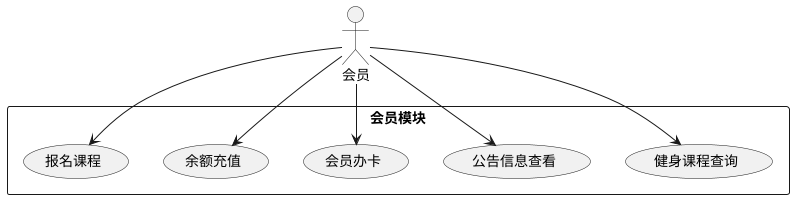
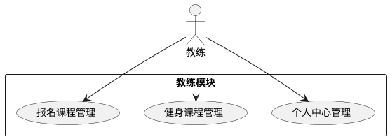
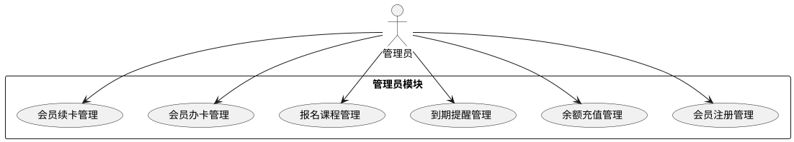

# 健身房管理系统需求规格说明书

## 1. 引言

### 1.1 文档目的
本文档旨在详细描述健身房管理系统的功能需求、非功能需求、数据需求等，为系统设计和开发提供明确的指导。该系统基于Spring Boot、MySQL、Vue.js和Java技术栈，实现会员管理、教练管理和管理员管理三大核心功能模块。

### 1.2 术语定义
- **会员**：在健身房注册并购买会员卡的用户
- **教练**：健身房聘请的专业健身指导人员
- **管理员**：负责系统日常运营和管理的人员
- **会员卡**：会员身份的凭证，包含不同类型（月卡、季卡、年卡等）
- **健身课程**：教练开设的团体或个人健身指导课程
- **余额**：会员在系统中预存的可用于消费的金额

## 2. 功能需求

### 2.1 会员模块

#### 2.1.1 健身课程查询
- **功能描述**：会员可以浏览和查询所有可预约的健身课程
- **输入**：课程名称、教练、时间段、课程类型等筛选条件
- **输出**：符合条件的课程列表，包含课程详情
- **流程**：会员进入课程页面 → 设置筛选条件 → 查看课程列表 → 查看课程详情

#### 2.1.2 公告信息查看
- **功能描述**：会员可以查看健身房发布的各类公告和活动信息
- **输入**：无
- **输出**：公告列表及详情
- **流程**：会员进入公告页面 → 浏览公告列表 → 查看公告详情

#### 2.1.3 会员办卡
- **功能描述**：会员可以申请办理新的会员卡
- **输入**：个人信息、选择会员卡类型、支付信息
- **输出**：办卡成功提示、会员卡信息
- **流程**：填写个人信息 → 选择会员卡类型 → 支付 → 完成办卡

#### 2.1.4 余额充值
- **功能描述**：会员可以为个人账户进行余额充值
- **输入**：充值金额、支付方式
- **输出**：充值成功提示、更新后的余额
- **流程**：选择充值金额 → 选择支付方式 → 完成支付 → 充值成功

#### 2.1.5 报名课程
- **功能描述**：会员可以报名参加健身课程
- **输入**：选择课程、确认报名
- **输出**：报名成功提示、报名记录
- **流程**：浏览课程 → 选择课程 → 确认报名 → 报名成功

### 2.2 教练模块

#### 2.2.1 个人中心管理
- **功能描述**：教练可以查看和编辑个人信息、工作状态等
- **输入**：个人信息修改内容
- **输出**：更新后的个人信息
- **流程**：登录系统 → 进入个人中心 → 修改信息 → 保存

#### 2.2.2 健身课程管理
- **功能描述**：教练可以创建、编辑、发布和管理自己的健身课程
- **输入**：课程信息（名称、时间、地点、描述、价格等）
- **输出**：课程列表、课程详情
- **流程**：创建课程 → 设置课程信息 → 发布课程 → 管理课程

#### 2.2.3 报名课程管理
- **功能描述**：教练可以查看报名自己课程的会员信息，管理课程报名情况
- **输入**：筛选条件（课程、时间段等）
- **输出**：报名列表、学员详情
- **流程**：进入课程管理 → 选择课程 → 查看报名情况 → 管理报名

### 2.3 管理员模块

#### 2.3.1 会员注册管理
- **功能描述**：管理员可以查看、管理和审核会员注册信息
- **输入**：筛选条件、状态更新操作
- **输出**：会员列表、会员详情、操作结果
- **流程**：进入会员管理 → 查看会员列表 → 审核/管理会员信息

#### 2.3.2 余额充值管理
- **功能描述**：管理员可以查看、管理会员的余额充值记录
- **输入**：查询条件、充值操作（为特殊情况）
- **输出**：充值记录列表、充值详情
- **流程**：进入余额管理 → 查看充值记录 → 管理充值信息

#### 2.3.3 到期提醒管理
- **功能描述**：管理员可以查看即将到期的会员卡信息，并发送提醒
- **输入**：查询条件、提醒操作
- **输出**：即将到期的会员卡列表、提醒发送状态
- **流程**：进入到期提醒 → 查看到期列表 → 发送提醒

#### 2.3.4 报名课程管理
- **功能描述**：管理员可以查看和管理所有课程的报名情况
- **输入**：查询条件、状态操作
- **输出**：报名记录列表、报名详情
- **流程**：进入报名管理 → 查看报名记录 → 管理报名信息

#### 2.3.5 会员办卡管理
- **功能描述**：管理员可以查看、管理所有会员卡的办理情况
- **输入**：查询条件、卡状态操作
- **输出**：会员卡列表、会员卡详情
- **流程**：进入办卡管理 → 查看办卡记录 → 管理会员卡

#### 2.3.6 会员续卡管理
- **功能描述**：管理员可以为会员办理会员卡续卡操作
- **输入**：会员信息、续卡类型、支付信息
- **输出**：续卡成功提示、更新后的会员卡信息
- **流程**：选择会员 → 选择续卡类型 → 处理支付 → 完成续卡

## 3. 非功能需求

### 3.1 性能需求
- 系统响应时间：页面加载时间不超过2秒，数据查询响应时间不超过3秒
- 并发处理能力：系统应支持至少100名用户同时在线操作
- 数据处理效率：批量操作（如报表生成）应在合理时间内完成

### 3.2 安全需求
- 用户认证与授权：基于角色的访问控制，确保不同用户只能访问其权限范围内的功能
- 数据安全：敏感数据加密存储，防止数据泄露
- 会话安全：防止会话劫持和跨站请求伪造攻击
- 日志记录：记录关键操作日志，便于审计和问题追踪

### 3.3 可用性需求
- 系统可用性：系统应保持99%以上的可用性
- 故障恢复：系统出现故障时，应能快速恢复并保证数据一致性
- 用户友好：界面设计简洁直观，操作流程顺畅

### 3.4 可维护性需求
- 代码规范：遵循Java和Vue.js开发规范，提供详细注释
- 模块化设计：系统功能模块化，便于维护和扩展
- 文档完备：提供完整的系统设计文档和API文档

## 4. 数据需求

### 4.1 核心数据实体

#### 4.1.1 会员信息
- 会员ID（主键）
- 用户名
- 密码（加密）
- 真实姓名
- 性别
- 出生日期
- 手机号
- 邮箱
- 注册日期
- 会员状态

#### 4.1.2 会员卡信息
- 会员卡ID（主键）
- 会员ID（外键）
- 卡号
- 卡类型（月卡、季卡、年卡等）
- 开通日期
- 到期日期
- 卡状态（有效、过期、冻结）
- 余额

#### 4.1.3 课程信息
- 课程ID（主键）
- 课程名称
- 教练ID（外键）
- 课程类型
- 课程描述
- 课程时长
- 课程价格
- 上课地点
- 课程状态

#### 4.1.4 教练信息
- 教练ID（主键）
- 用户名
- 密码（加密）
- 真实姓名
- 性别
- 手机号
- 邮箱
- 专业领域
- 教练状态

#### 4.1.5 报名信息
- 报名ID（主键）
- 课程ID（外键）
- 会员ID（外键）
- 报名日期
- 报名状态

#### 4.1.6 充值记录
- 充值ID（主键）
- 会员ID（外键）
- 充值金额
- 充值时间
- 支付方式
- 充值状态

#### 4.1.7 公告信息
- 公告ID（主键）
- 标题
- 内容
- 发布日期
- 发布人
- 状态

### 4.2 数据关系
- 会员与会员卡：一对多关系（一个会员可以有多个会员卡）
- 会员与报名：一对多关系（一个会员可以报名多个课程）
- 课程与教练：多对一关系（一个教练可以教授多个课程）
- 课程与报名：一对多关系（一个课程可以有多个报名记录）
- 会员与充值记录：一对多关系（一个会员可以有多条充值记录）

## 5. 系统架构

### 5.1 技术架构
- **前端**：Vue.js + Element Plus
- **后端**：Spring Boot + Spring Security + MyBatis-Plus
- **数据库**：MySQL
- **缓存**：Redis
- **认证**：JWT

### 5.2 系统层次
- **表现层**：负责用户界面展示和交互
- **控制层**：处理用户请求，协调业务逻辑
- **业务层**：实现核心业务逻辑
- **数据访问层**：负责与数据库交互
- **基础设施层**：提供系统基础设施支持

## 6. 用例图

### 6.1 会员模块用例图

### 6.2 教练模块用例图

### 6.3 管理员模块用例图

### 6.4 系统总体用例图

```plantuml
@startuml 系统总体用例图

actor 会员 as Member
actor 教练 as Coach
actor 管理员 as Admin

package "健身房管理系统" {
  package "会员模块" {
    usecase "健身课程查询" as CourseQuery
    usecase "公告信息查看" as AnnouncementView
    usecase "会员办卡" as ApplyCard
    usecase "余额充值" as Recharge
    usecase "报名课程" as EnrollCourse
  }
  
  package "教练模块" {
    usecase "个人中心管理" as PersonalCenter
    usecase "健身课程管理" as CourseManage
    usecase "报名课程管理" as EnrollmentManage
  }
  
  package "管理员模块" {
    usecase "会员注册管理" as MemberManage
    usecase "余额充值管理" as RechargeManage
    usecase "到期提醒管理" as ExpiryRemind
    usecase "报名课程管理" as EnrollManage
    usecase "会员办卡管理" as CardManage
    usecase "会员续卡管理" as RenewCardManage
  }
}

Member --> CourseQuery
Member --> AnnouncementView
Member --> ApplyCard
Member --> Recharge
Member --> EnrollCourse

Coach --> PersonalCenter
Coach --> CourseManage
Coach --> EnrollmentManage

Admin --> MemberManage
Admin --> RechargeManage
Admin --> ExpiryRemind
Admin --> EnrollManage
Admin --> CardManage
Admin --> RenewCardManage

@enduml
```

## 7. 范围限定

- 系统仅支持中文界面和中文数据处理
- 系统不涉及第三方支付集成，仅模拟支付流程
- 系统不包含复杂的数据分析和报表功能
- 系统不考虑移动端适配，仅针对Web端桌面应用

## 8. 验收标准

### 8.1 功能验收
- 所有功能需求项应全部实现并可正常使用
- 界面操作流畅，符合用户习惯
- 数据处理准确，无数据丢失或错误

### 8.2 性能验收
- 系统响应时间满足性能需求
- 并发用户数达到设计要求
- 系统稳定运行无异常

### 8.3 安全验收
- 用户认证和授权功能正常
- 敏感数据加密存储
- 系统无明显安全漏洞

## 9. 风险评估

| 风险项 | 影响程度 | 可能性 | 应对措施 |
|-------|---------|-------|--------|
| 数据安全风险 | 高 | 中 | 实施数据加密、访问控制和定期备份 |
| 系统性能风险 | 中 | 中 | 优化数据库查询、使用缓存机制 |
| 用户体验风险 | 中 | 低 | 进行用户测试，收集反馈并优化界面 |
| 技术选型风险 | 低 | 低 | 选择成熟稳定的技术栈，做好技术储备 |

## 10. 附录

### 10.1 参考资料
- 《Spring Boot实战》
- 《Vue.js权威指南》
- 《MySQL数据库设计与优化》
- 行业标准和最佳实践

### 10.2 版本历史
| 版本 | 日期 | 描述 | 作者 |
|------|------|------|------|
| 1.0  | 2023-XX-XX | 初始版本 | 系统分析师 |
| 1.1  | 2023-XX-XX | 更新功能需求 | 系统分析师 |